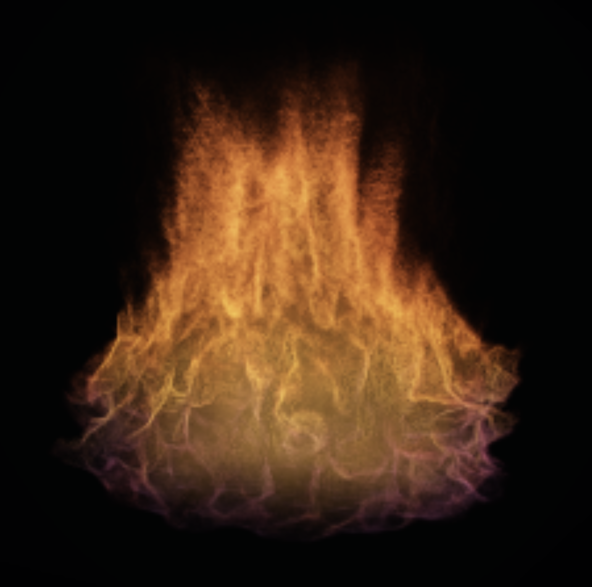

# Kaminos

> A browser-native workbench for making generated worlds live.

Kaminos brings generated beings, live materials, local inference, motion, and
spatial assets into one inspectable WebGPU workbench. It is where difficult
technical systems become visible enough to steer, compose, and decide around
while they are still alive.

The project spans four connected capabilities:

- **Generated beings**. Generated creatures can preserve deliberate morphology
  through generative transformation and return to mechanical control.
- **Live materials**. Simulated structure, appearance, and motion remain
  authorable while state advances.
- **Browser-native intelligence**. Spatial models execute inside the same local
  environment that inspects and consumes their outputs.
- **A world kiln**. Images, meshes, splats, motion, material fields, simulation
  state, and generated environments become composable world matter.

[](https://lyonsno.github.io/kaminos/)

## Live Browser Combustion

These films were captured directly from the live browser runtime while one
stateful WebGPU combustion material was being authored, not prerendered.

The material carries its history through control changes. Existing momentum
continues through contraction, acceleration, chromatic transition, changing
source geometry, and renewed expansion. A broad burner can gather into a jet,
retain the structure already in flight, and rebuild into another morphology
without resetting the simulation.

[Live Combustion](https://lyonsno.github.io/kaminos/) presents one complete composition, four
authored transitions, and seven compact studies of color, structure, width, and
state history.

Kaminos currently carries a multi-field volumetric fire and smoke simulation
that runs directly in the browser through WebGPU. Its current boundary-fire
renderer derives compact structural fields around the combustion front, then
uses those fields to guide where the volumetric renderer spends work.

The result is a live material process with:

- dynamic fire and smoke at interactive cadence;
- live simulation routes developed and profiled on Apple Silicon;
- combustion-front topology and baked boundary-sidecar fields;
- support, coverage, ridge, proximity, and footprint guidance;
- adaptive raymarch and explicit quality controls;
- route, backend, effective-control, and performance receipts;
- durable state capture and replay for visual investigation.

The fire began as an answer to a product question: how can a local AI
experience remain alive while expensive inference occupies the machine? It is
now becoming a material and rendering research program of its own.

## Generated Beings

Generated creatures can preserve deliberate morphology through generative
transformation and return to mechanical control.

Deliberate edits to a parameterized creature template have produced
corresponding changes after image generation and image-to-3D reconstruction.
Using recovered correspondence, one reconstruction was registered to a control
rig and manually skinned for large articulated deformations; another was driven
by synthesized terrain-following motion.

That result reaches recovered structure and downstream mechanical consumption.
The continuing research frontier is editable authority: returning distinctions
authored by the generator as durable, named controls that can survive another
generation and accumulate into later rounds of authorship.

## Browser-Native Intelligence

Spatial models execute inside the same browser environment that consumes their
outputs. Local WebGPU inference, geometry, motion, and simulation can therefore
remain part of one operating world rather than terminating at a model response
or crossing into a disconnected application.

The workbench preserves requested and effective route identity, model and
backend lifecycle, generated assets, live state, and the inspection surfaces
needed to decide what should happen next.

## The World Kiln

Kaminos treats generated outputs as world matter with lineage and behavior.
Images, meshes, splats, motion, material fields, simulation state, and route
outputs enter a shared browser workbench where they can be inspected,
conditioned, transformed, staged, and handed onward.

Current substrate includes:

- Three.js/WebGPU scene editing and persistence;
- source-aware splat import, correction, crop, orientation, and sidecars;
- mesh/splat hybrid rendering and scene-context integration;
- motion-generation and motion-transposition experiments;
- browser-native fluid, particle, and material processes;
- world/chamber contracts for generated environments and inhabitants;
- route receipts that distinguish requested and effective execution;
- smoke and witness harnesses for visual and technical evidence.

The architecture is documented in [Spatial Asset Kiln](docs/spatial-asset-kiln.md).
Splat lineage and correction contracts are documented in
[Splat Assets](docs/splat-assets.md).

## From Source To Cast

The product direction is a complete visible loop:

```text
source -> route -> live work -> generated matter -> inspectable cast
```

A team should be able to choose a source, fire a real local route, remain
inside a living workroom while compute runs, and inspect the resulting object
without crossing into a disconnected tool or dead waiting screen.

This loop is being assembled from the same browser-native systems already used
for volumetric fire, splats, generated assets, motion, route scheduling, and
scene inspection.

## Decision Artifacts

Kaminos projects are organized around one expensive uncertainty. The goal is a
live artifact that makes the next product decision obvious enough to fund,
staff, transfer, continue, or kill.

The recurring engineering move is to find the missing representation that
makes the system tractable. In the current fire route, combustion-front and
boundary fields turn an expensive volumetric search into guided rendering. In
generated-world routes, the corresponding representation may be a depth or
normal field, splat, mesh, semantic substrate, motion packet, route receipt, or
world-state contract.

The visible experience carries the idea. The accompanying implementation,
tests, route identity, performance evidence, and handoff notes make it usable
after the demonstration ends.

## Run Locally

Kaminos is developed as a local browser application. Serve the checkout:

```sh
python3 serve.py 8095
```

Open the current volume route in a WebGPU-capable Chromium browser:

```text
http://127.0.0.1:8095/?kaminos_volume_smoke=1&volume_scene=tall_plume
```

The strongest current route is developed and witnessed on Apple Silicon. Other
WebGPU devices may expose different performance and feature boundaries.

## Status

Kaminos is an active research and product prototype. Internal contracts,
control surfaces, and route integrations are evolving quickly. Publicly useful
subsystems are being separated into focused packages and upstream contributions
as their interfaces settle.

For technical or collaboration inquiries, contact
[Noah Lyons](https://github.com/lyonsno).
