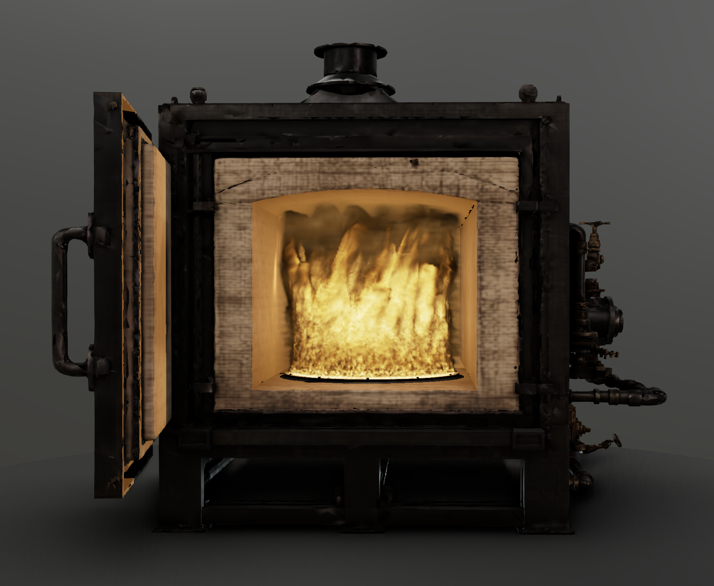

# Kaminos

> Browser-native WebGPU inference, realtime simulation, and generated spatial systems in one inspectable workbench.

Kaminos is the browser-based authoring workbench where several independently
useful systems meet. It keeps a spatial scene alive while local models run,
receives their outputs as editable world matter, and turns runtime machinery
that survives the workbench into reusable packages and focused model ports.

The repository spans four connected capabilities:

- **Browser-native intelligence**. A published WebGPU inference runtime and a
  growing family of spatial and generative model ports run as components of an
  interactive browser application.
- **Live materials**. Stateful fire, smoke, fluids, particles, and rendering
  processes remain visible and authorable while compute continues.
- **Generated beings**. Generated creatures can preserve deliberate morphology
  through generative transformation and return to mechanical control.
- **A world kiln**. Images, meshes, splats, motion, material fields, simulation
  state, and generated environments can be inspected, corrected, staged, and
  composed in one WebGPU workbench.

[](https://lyonsno.github.io/kaminos/)

## Start Here

| Surface | What it demonstrates | Entry point |
| --- | --- | --- |
| Live combustion | A stateful browser-native fire material being driven through ignition, contraction, chromatic change, extinction, and rebirth | [Open the live screening room](https://lyonsno.github.io/kaminos/) |
| Generated beings | Deliberate morphology surviving generative transformation, reconstructed casts returning to mechanical control, and a separate creature consuming terrain-relative motion | [Inspect the generated-being chain](docs/generated-beings/README.md) |
| WebGPU inference kit | Shared-device lifecycle, persistent model routes, queues, cooperative scheduling, resource residency, progress, and runtime telemetry | [Read the package guide](webgpu-inference-kit/README.md) or [open npm](https://www.npmjs.com/package/@kaminos/webgpu-inference-kit) |
| Spatial model ports | MoGe depth and normals, SHARP Gaussian reconstruction, SF3D textured meshes, Kimodo motion diffusion, and an in-tree SAM segmentation route | [Inspect the port family](webgpu-inference-kit/README.md#one-runtime-different-models) |
| Spatial Asset Kiln | The workbench architecture for generated assets, live routes, World Chambers, Preview Benches, and Smoke Offers | [Read the architecture](docs/spatial-asset-kiln.md) |

## One Browser, One GPU

The architectural center of Kaminos is a simple product requirement: local AI
should behave like part of an application, not replace the application with a
modal wait.

In one measured M4 Max Chrome run, **SHARP generated 1,179,648 Gaussian splats
in 185.3 seconds while the full Kaminos fire volume continued to simulate on
every frame in the same browser and on the same GPU**. Across 21,818 foreground
frame intervals, p95 and p99 were 9.3ms and 10.0ms; 40 intervals exceeded
33.3ms.

In a separate shared-device run, **Stable Fast 3D produced a complete textured
GLB in 41.9 seconds while servicing 3,644 host frames**. Page frame intervals
had a p99 of 9.7ms and a maximum of 92.4ms, and the output was byte-identical to
the monolithic route's output.

Kaminos is the authoring surface. The
[`@kaminos/webgpu-inference-kit`](webgpu-inference-kit/README.md) is the reusable
runtime extracted from the work required to keep that surface responsive while
substantial models execute.

## WebGPU Inference Kit

The inference kit gives browser model ports a shared session and device
lifecycle, persistent routes, queued invocations, cooperative scheduling,
foreground opportunities, resource residency, and terminal state. Model ports
retain ownership of their weights, kernels, tensor semantics, execution order,
and outputs.

```sh
npm install @kaminos/webgpu-inference-kit
```

The same runtime grammar now composes model implementations with very different
shapes:

| Port | Browser-native result | Runtime integration |
| --- | --- | --- |
| [MoGe](https://github.com/lyonsno/moge-webgpu) | Depth, normals, and point maps from one image | Embeddable feed-forward pipeline with reusable buffers and bounded submissions |
| [SHARP](https://github.com/lyonsno/sharp-webgpu) | A Gaussian-splat scene from one image | Adaptive cooperative scheduling and shared-device foreground rendering |
| [Stable Fast 3D](https://github.com/lyonsno/sf3d-webgpu) | A textured, UV-unwrapped GLB from one image | Cooperative GPU work, reusable scratch memory, and worker offload |
| [Kimodo](https://github.com/lyonsno/kimodo-webgpu) | Skeletal motion from a text prompt | Browser diffusion and motion decoding with rendering opportunities between transformer passes |
| SAM, in development | Reusable image features and masks from image-and-prompt segmentation | Persistent model resources, cached embeddings, and queued semantic requests |

The package includes a complete minimal port, an executable render-plus-inference
walkthrough, focused integration documentation, and runtime contracts for
admission, scheduling, lifecycle, resources, and receipts.

## Live Browser Combustion

[](https://lyonsno.github.io/kaminos/)

These films were captured directly from the live browser runtime while one
stateful WebGPU combustion material was being authored, not prerendered.

The material carries its history through control changes. Existing momentum
continues through contraction, acceleration, chromatic transition, changing
source geometry, and renewed expansion. A broad burner can gather into a jet,
retain the structure already in flight, and rebuild into another morphology
without resetting the simulation.

[Live Combustion](https://lyonsno.github.io/kaminos/) presents one complete
composition, four authored transitions, and seven compact studies of color,
structure, width, and state history.

The current multi-field simulation runs directly in the browser through
WebGPU. Its boundary-fire renderer derives compact structural fields around the
combustion front, then uses those fields to guide where the volumetric renderer
spends work. The same material can run in the isolated screening room, inhabit
arbitrary scene geometry, or remain active as the foreground workload around
browser inference.

The fire began as an answer to the question that produced the inference kit:
what should a local AI application do while expensive inference occupies the
machine? It should stay alive.

## Generated Beings

Generated creatures can preserve deliberate morphology through generative
transformation and return to mechanical control.

[](docs/generated-beings/README.md)

Deliberate edits to a parameterized creature template have produced
corresponding changes after image generation and image-to-3D reconstruction.
Using recovered correspondence, one reconstruction was registered to a control
rig and manually skinned for large articulated deformations; another was driven
by synthesized terrain-following motion.

That work joins analytical authorship, generative elaboration, reconstructed
geometry, rigging, articulation, and motion in one loop. The continuing
frontier is stronger editable control: returning distinctions authored before
generation as durable controls that can survive later rounds of transformation.

[Inspect the generated-being chain](docs/generated-beings/README.md), including
the held morphology intervention, round-trip registration measurements,
articulated returned cast, terrain-motion sequence, and the exact boundary of
each result.

## Spatial Asset Kiln

The workbench receives images, meshes, splats, motion, material fields,
simulation state, and generated environments as things that can be handled,
not merely viewed. Current substrate includes:

- Three.js/WebGPU scene editing, cameras, lighting, and persistence;
- splat import, correction, crop, orientation, and sidecars;
- mesh/splat hybrid rendering and scene-context integration;
- motion generation, transposition, preview, and export experiments;
- browser-native fluid, particle, and volumetric material processes;
- World Chambers and Preview Benches for coherent generated environments;
- Smoke Offers and browser witnesses for handing live visual work between
  producers and the operator.

The architecture is documented in [Spatial Asset Kiln](docs/spatial-asset-kiln.md).
Splat correction and renderer-consumption contracts are documented in
[Splat Assets](docs/splat-assets.md).

The longer product loop is already visible in the repository:

```text
source -> model route -> live workbench -> generated matter -> authored world
```

## Repository Atlas

| Path | Role |
| --- | --- |
| [`index.html`](index.html) | Main Three.js/WebGPU workbench, scene editor, rendering routes, and authoring controls |
| [`serve.py`](serve.py) | Local server and asset-browse API for Kaminos and sibling model outputs |
| [`webgpu-inference-kit/`](webgpu-inference-kit/) | Published runtime package, examples, integration guides, and contract tests |
| [`docs/flame-atlas/`](docs/flame-atlas/) | Public live-combustion screening room and capture manifest |
| [`models/`](models/) and [`pipelines/`](pipelines/) | In-tree experimental models and generated-asset pipelines |
| [`docs/`](docs/) | Kiln, splat, structural-control, and route architecture |
| [`tests/`](tests/) | Browser, runtime, scene, simulation, pipeline, and public-surface contracts |
| [`artifacts/`](artifacts/) | Retained visual investigations and renderer studies |

Focused model ports live in their own repositories once their boundaries are
strong enough to stand alone. Kaminos remains the place where those ports meet
rendering, simulation, generated assets, and actual product behavior.

## Run Locally

Serve the checkout:

```sh
python3 serve.py 8095
```

Open the current volume route in a WebGPU-capable Chromium browser:

```text
http://127.0.0.1:8095/?kaminos_volume_smoke=1&volume_scene=tall_plume
```

The strongest current routes are developed and measured on Apple Silicon.
Other WebGPU devices may expose different performance and feature boundaries.

## Status

Kaminos is an active research workbench. The inference runtime is published as
a reusable npm package; the combustion material, generated-world controls, and
spatial authoring surfaces continue to evolve in the workbench; focused model
ports graduate into their own repositories.

For technical or collaboration inquiries, contact
[Noah Lyons](https://github.com/lyonsno).
