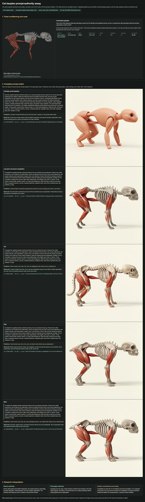
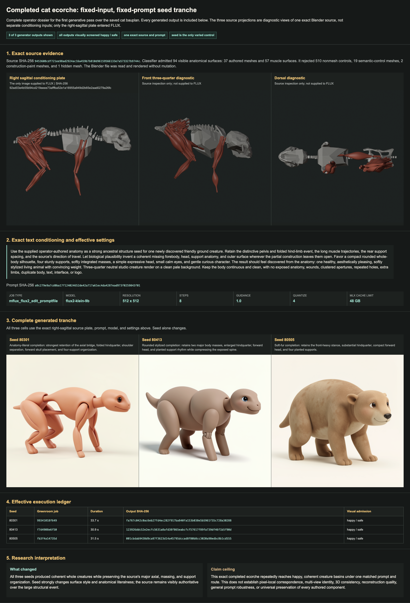

# Completed Cat Ecorche Generator Assay

## Prompt Authority Result

A fixed-source, fixed-seed five-cell switch now separates three generator controls that had previously been conflated. The authored bauplan controls the global axial, support, shoulder, head-placement, and folded-hindquarter event. A named taxon changes local phenotype, especially tail, feet, distal supports, and stance. Surface commitment is a third axis: the friendly-round baseline produces a continuous living exterior, while the preservation-heavy low-prior template remains an ecorche even when it explicitly requests an outer surface.

The exact source image, complete prompts, effective settings, all five outputs, execution receipts, pre-result predictions, and post-result readings are archived in `flux2-prompt-switch-seed80301-v0/assay-sheet.html`. All five outputs were visually screened happy and safe.

The source-ranked real-cat positive-control acquisition order is recorded in `cat-skeleton-positive-control-source-shortlist.md`. The default is to request the CT-derived 3D Anatomy Studios Blender assembly and inspect the Tavernier Amaury whole-skeleton photogrammetry archive in parallel.

## Campaign Result

The newly completed operator-authored cat ecorche is already a viable generator-conditioning object. Three FLUX.2 Klein 9B cells varied only the seed; all three produced coherent, aesthetically admitted, happy and safe whole creatures.

The result is stronger than generic creature completion. Across anatomical clay, rounded stylization, and soft fur, the outputs retain the source's large folded hindquarter, long axial organization, forward head, separated shoulder event, and four-support rhythm. Surface style is seed-sensitive, but the major structural grammar is source-sensitive.

## What Changed

Before this tranche, the strongest evidence came from a partial tight crop whose generator output had to invent a missing forebody and head. The completed source now provides skull, cervical chain, thorax, pelvis, hindquarter musculature, and front support evidence in one projection. The generator can consume that denser object without becoming aesthetically hostile or collapsing all structure into one generic animal.

The seed remains a major aesthetic control. Seed `80301` preserves the ecorche most literally. Seed `80413` compresses it into a rounder character. Seed `80505` adds a coherent fur surface and a bear-like head. That variation is useful, but it also means one output cannot stand in for correspondence strength.

## Next Comparison

The next matched assay should hold seed, prompt, camera, and generator settings fixed while changing only source representation:

1. the exposed ecorche plate admitted here;
2. a low-frequency analytical skin compiled over the same authored structure;
3. the analytical skin with selected structural landmarks intentionally visible, if the first two cells show a useful tradeoff.

That comparison asks whether skinning improves aesthetic prior alignment without erasing the anatomical authority that made this tranche work. More random seeds are lower leverage until that representation question is reduced.

## Claim Ceiling

Admitted: this exact completed ecorche repeatedly produces coherent, aesthetically admitted whole-creature completions under one matched prompt and route, with major source organization surviving across three seeds.

Not established: pixel-local correspondence, multi-view identity, 3D consistency, reconstruction quality, rigging, motion transfer, general prompt robustness, or universal preservation of every authored component.

## Audit

- Blender source: `/Users/noahlyons/dev/operator-scratch/blender-scenes/cat-bauplan.blend`
- Source SHA-256: `9453608cdf721ee98ad2924ac16a459b7b810d96159566133e7a573327b9744c`
- Source plate SHA-256: `92ad03e4b55b94cd219eeee73afffba52e1a16955a949d2b65e2aad0279a26fc`
- Generator jobs: `99341018f649`, `f7d4908e6f50`, `fb3f4a14735d`
- Exact settings and output identities: `flux2-matched-tranche/campaign.json`
- Complete operator dossier: `flux2-matched-tranche/assay-sheet.html`
- Full-page static dossier: `flux2-matched-tranche/full-page-assay-sheet.png`
