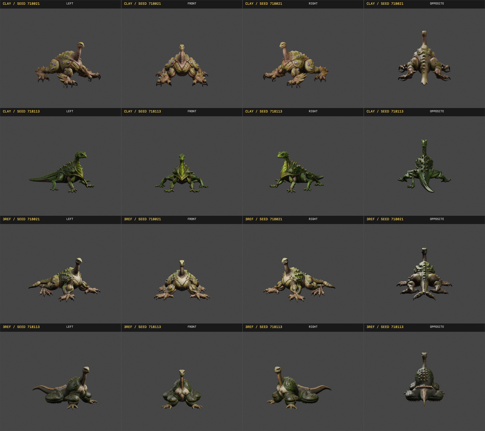

# Bulbous Radial Upright Armature Imagegen Assay

## Question

Can Flux2 Klein 9B turn one fitted implicit 3D creature armature into coherent creature anatomy while preserving its unusual body plan, and how does aligned clay/depth/normal conditioning change the balance between structural adherence and model-prior invention?

The fixed armature has a paired bulbous posterior, broad forward chest, narrow segmented upright neck, small terminal head, and eight low radial contact appendages. The source is intentionally primitive enough that successful output requires the model to invent connective anatomy rather than copy a finished creature.

## Matrix

All eight cells used `gpu-greenroom` with effective Flux2 Klein 9B, q4, 512x512, eight steps, guidance 1.0, and a 48 GB MLX cache limit. `plan.json`, `submission-report.json`, and `completion-report.json` bind the requested and effective routes, input and prompt hashes, all job IDs, timestamps, and output hashes.

The contact sheet is ordered as follows:

| | Column 1 | Column 2 | Column 3 | Column 4 |
| --- | --- | --- | --- | --- |
| Top: clay only | controlled, seed 718021 | controlled, seed 718113 | invention, seed 718021 | invention, seed 718113 |
| Bottom: clay + depth + normal | controlled, seed 718021 | controlled, seed 718113 | invention, seed 718021 | invention, seed 718113 |

The individual durable PNGs are in `outputs/`.

## Result

This is a structural hit. Every cell is a connected, volumetric, visually legible creature. All eight preserve the load-bearing upright-front and posterior-heavy gestalt. The outputs are not screen-space interpolations or symbolic icons; they invent joints, feet, tissue transitions, shell or hide details, sensory anatomy, and grounded contact while remaining visibly descended from the fitted armature.

Clay-only leaves more room for the model prior. It produces the clearest articulated feet, negative spaces, and creature-like connective anatomy. The invention prompt materially raises anatomical richness and silhouette complexity without severing lineage from the source.

Aligned clay/depth/normal conditioning increases loyalty to the proxy's local lobe and paddle geometry. Same-seed pairs remain recognizably related across reference regimes. Seed 718021 under the controlled prompt is the clearest example: the three-reference output closely tracks the clay-only creature but resolves the front contact as a broader paddle. Seed 718113 reveals the cost of stronger adherence: several proxy lobes remain bulbous masses instead of becoming fully articulated limbs.

The useful control axis is therefore real:

- clay-only favors prior completion and anatomical articulation;
- clay/depth/normal favors local proxy adherence;
- controlled prompting preserves a simpler morphology;
- invention prompting adds production-level anatomy and surface language;
- seed variation changes the creature family while preserving the armature's deep gestalt.

## Timing

The four clay-only cells took 31.5-37.0 seconds each, averaging 33.2 seconds. The three-reference cells took 59.7-75.7 seconds each, averaging 69.6 seconds. Strict FIFO execution of all eight inference jobs occupied about 411 seconds of GPU runtime. The stronger control regime costs approximately 2.1x the clay-only route at this configuration.

## 3D Promotion

The four invention cells form the highest-value Trellis continuation: two image seeds crossed with clay-only versus clay/depth/normal conditioning. `trellis/plan.json` fixes the downstream route at `gpu-greenroom/trellis2mlx_fast`, seed 42, 512 resolution, six steps, no cascade, a 200,000-face target, 1024px textures, and simplify-first. This preserves a causal comparison through 3D reconstruction instead of promoting only the prettiest still.

All four GLBs completed through the requested route and passed input, route, and output-hash validation. The exact accepted files are preserved under `trellis/outputs/`. Trellis generation took 50.4-64.5 seconds per cast, averaging 56.0 seconds and totaling 224.1 seconds. The Trellis seed remained fixed at 42, so the visible differences descend from the imagegen reference regime and image seed rather than a downstream seed change.

The sixteen-view witness was directly inspected across left, front, right, and opposite views for every cast. All four outputs are coherent spatial creatures rather than textured cards: each has a resolved back, connected body mass, grounded appendages, and materially distinct opposite-side anatomy. No asset collapsed into a missing-back or front-only reconstruction.

The two reference regimes remain discriminable after reconstruction:

- clay-only, seed 718021 becomes a low broad creature with a long upright neck, massive radial front limbs, and resolved posterior anatomy;
- clay-only, seed 718113 makes the largest prior-driven leap into a green quadrupedal lineage with articulated legs, a long tail, and a complete dorsal side;
- clay/depth/normal, seed 718021 most strongly preserves the source armature's broad radial stance, paired body mass, upright neck, and enlarged front contacts while resolving them into creature anatomy;
- clay/depth/normal, seed 718113 preserves the proxy massing as a compact bulbous body with an upright neck, paired lobes, and a tail, with less limb articulation than the clay-only sibling.

The result establishes the complete route: one crude fitted 3D armature can seed multiple coherent image basins, and those basins can survive Trellis as distinct, fully spatial creature casts. Clay-only is the stronger invention route. Clay/depth/normal is the stronger structural-adherence route. Their difference remains useful through the final 3D representation instead of disappearing after image generation.

Rendering and validating all sixteen witness frames took 17.1 seconds total, averaging 1.1 seconds per view. `trellis/completion-report.json`, `trellis/witness-completion-report.json`, and `trellis/witness-contact-sheet-receipt.json` carry the effective commands, hashes, timing, and direct-inspection claim.
