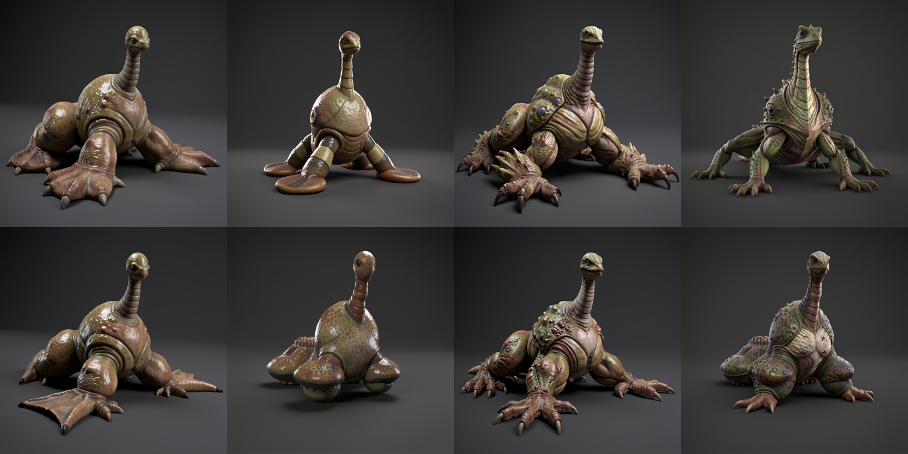

# Bulbous Radial Upright Armature Imagegen Assay

## Question

Can Flux2 Klein 9B turn one fitted implicit 3D creature armature into coherent creature anatomy while preserving its unusual body plan, and how does aligned clay/depth/normal conditioning change the balance between structural adherence and model-prior invention?

The fixed armature has a paired bulbous posterior, broad forward chest, narrow segmented upright neck, small terminal head, and eight low radial contact appendages. The source is intentionally primitive enough that successful output requires the model to invent connective anatomy rather than copy a finished creature.

## Matrix

All eight cells used `gpu-greenroom` with effective Flux2 Klein 9B, q4, 512x512, eight steps, guidance 1.0, and a 48 GB MLX cache limit. `plan.json`, `submission-report.json`, and `completion-report.json` bind the requested and effective routes, input and prompt hashes, all job IDs, timestamps, and output hashes.

The contact sheet is ordered as follows:

| | Column 1 | Column 2 | Column 3 | Column 4 |
| --- | --- | --- | --- | --- |
| Top: clay only | controlled, seed 718021 | controlled, seed 718113 | invention, seed 718021 | invention, seed 718113 |
| Bottom: clay + depth + normal | controlled, seed 718021 | controlled, seed 718113 | invention, seed 718021 | invention, seed 718113 |

The individual durable PNGs are in `outputs/`.

## Result

This is a structural hit. Every cell is a connected, volumetric, visually legible creature. All eight preserve the load-bearing upright-front and posterior-heavy gestalt. The outputs are not screen-space interpolations or symbolic icons; they invent joints, feet, tissue transitions, shell or hide details, sensory anatomy, and grounded contact while remaining visibly descended from the fitted armature.

Clay-only leaves more room for the model prior. It produces the clearest articulated feet, negative spaces, and creature-like connective anatomy. The invention prompt materially raises anatomical richness and silhouette complexity without severing lineage from the source.

Aligned clay/depth/normal conditioning increases loyalty to the proxy's local lobe and paddle geometry. Same-seed pairs remain recognizably related across reference regimes. Seed 718021 under the controlled prompt is the clearest example: the three-reference output closely tracks the clay-only creature but resolves the front contact as a broader paddle. Seed 718113 reveals the cost of stronger adherence: several proxy lobes remain bulbous masses instead of becoming fully articulated limbs.

The useful control axis is therefore real:

- clay-only favors prior completion and anatomical articulation;
- clay/depth/normal favors local proxy adherence;
- controlled prompting preserves a simpler morphology;
- invention prompting adds production-level anatomy and surface language;
- seed variation changes the creature family while preserving the armature's deep gestalt.

## Timing

The four clay-only cells took 31.5-37.0 seconds each, averaging 33.2 seconds. The three-reference cells took 59.7-75.7 seconds each, averaging 69.6 seconds. Strict FIFO execution of all eight inference jobs occupied about 411 seconds of GPU runtime. The stronger control regime costs approximately 2.1x the clay-only route at this configuration.

## 3D Promotion

The four invention cells form the highest-value Trellis continuation: two image seeds crossed with clay-only versus clay/depth/normal conditioning. `trellis/plan.json` fixes the downstream route at `gpu-greenroom/trellis2mlx_fast`, seed 42, 512 resolution, six steps, no cascade, a 200,000-face target, 1024px textures, and simplify-first. This preserves a causal comparison through 3D reconstruction instead of promoting only the prettiest still.

Spatial coherence remains unclaimed until each GLB completes route validation and four rendered witness views survive direct visual inspection.
