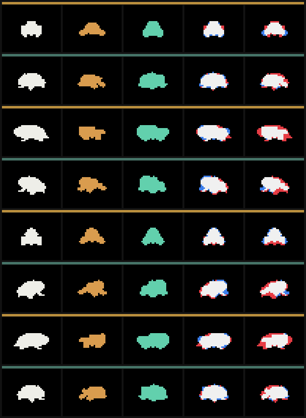
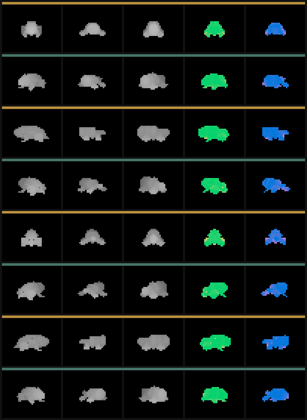

# Reference-Fitted Armature Assay v0

## Question

Can a coherent outside creature asset donate production-relevant proportions to a clean semantic SDF armature, with convergence measured on camera views that the fitter never sees?

## Donor and contract

The donor is the existing basin 22 lineage Trellis cast:

`../lirm-speciation-armature-gestalt-composite-assay-v0/trellis/glbs/lirm-armature-22__basin-22-s1p50-n00-p046-lineage-seed-seed717046.glb`

- Donor SHA-256: `5b481bfddb75dffc27c2c518f3cfcc5ea0407a4545c3fcff7bb61c3e27a55088`
- Admitted triangles: 154,742
- Effective route: `kaminos/reference-fitted-armature/software-glb-raster-plus-sdf-fit-v0`
- Evidence resolution: 40 x 32 pixels per view
- Fit cameras: `az000`, `az090`, `az180`, `az270`
- Held-out cameras: `az045`, `az135`, `az225`, `az315`
- Solver: four-pass deterministic bounded coordinate search
- Assay runtime: 5.107 seconds

The GLB is parsed directly. All mesh primitives and node transforms are normalized once, then rasterized through eight explicit orthographic cameras. The same camera table renders the armature. Camera fallback, partial view coverage, missing outputs, donor hash absence, and fit/held-out overlap fail the assay.

## Armature vocabulary

The fitted object remains a semantic SDF program with thirteen editable parameters:

`bodyLength`, `bodyWidth`, `bodyHeight`, `headScale`, `bellyScale`, `tailScale`, `dorsalLift`, `curveAmplitude`, `limbLength`, `limbSpread`, `limbThickness`, `contactHeight`, and `headLift`.

Those parameters drive smooth-unioned ellipsoid body masses, a head-orientation mass, four contact limbs, and four ground-contact volumes. The fitter does not copy donor triangles or optimize an unstructured voxel field.

## Result

| Evidence split | Metric | Initial | Fitted | Delta |
| --- | --- | ---: | ---: | ---: |
| Fit views | Mean silhouette IoU | 0.6773 | 0.8424 | +0.1650 |
| Fit views | Mean depth MAE | 0.0450 | 0.0339 | -0.0111 |
| Held-out views | Mean silhouette IoU | 0.6982 | 0.8027 | +0.1045 |
| Held-out views | Mean depth MAE | 0.0390 | 0.0273 | -0.0117 |
| Held-out views | Mean occupancy error | 0.1973 | 0.0328 | -0.1645 |

All four held-out silhouettes improve. The fitted body visibly lengthens and thickens, the contact footprint narrows, and the initial splayed arch collapses toward the donor's squat crawler gestalt across every azimuth.

Columns are donor, initial armature, fitted armature, donor/fitted overlay, and donor/initial overlay. White is overlap, red is missing armature area, and blue is excess armature area.

Columns are donor depth, initial depth, fitted depth, fitted depth error, and initial depth error.

## Interpretation

The first gate is satisfied: external three-dimensional evidence can recover gross creature proportions as a compact, editable semantic program, and the recovered program generalizes to unseen views. This creates a credible convergence route between stochastic creature casts and production-controlled morphology.

No parameter reaches a declared bound. The fitted program preserves all thirteen semantic levers, including the now-effective `limbLength`, as a compact editable crawler program. The visible residual is concentrated in the donor's asymmetric appendages and local dorsal structure. Those details require topology-family choice or a richer semantic program; parameter fitting alone cannot express them.

## Bounded claim

This assay proves reference-fitted gross morphology for one known crawler family. It does not establish topology-family selection, image-only camera recovery, production surface reconstruction, rigging, or a learned morphology prior.

The next high-leverage assay is family selection before parameter fitting: several small semantic topology programs compete against the same multi-view donor evidence, then the winning family receives the bounded fit. Repeating that over generated and harvested donors would produce the first supervised corpus of `reference evidence -> topology program -> semantic parameters -> residuals`.

The machine-readable source of truth is [report.json](report.json).
