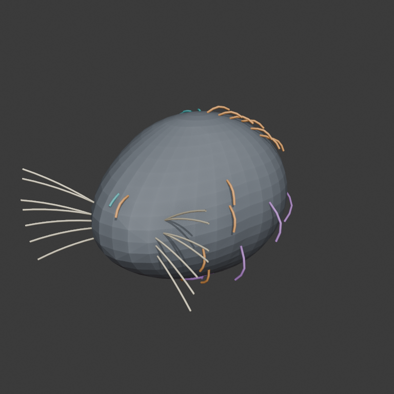
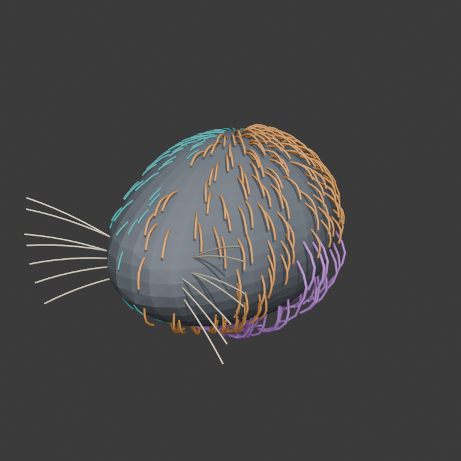
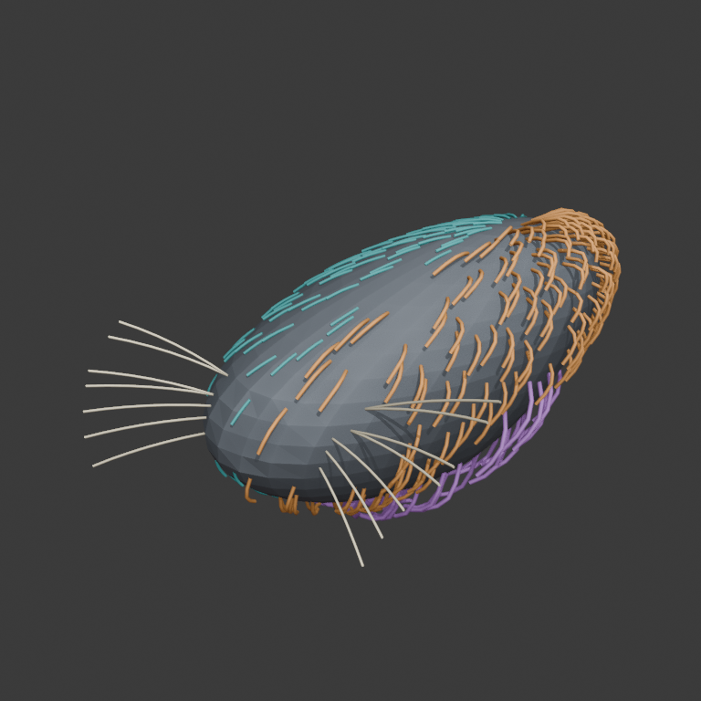

# Procedural Groom Truth v0 — Evidence Sheet

## Question

Can one canonical carrier-bound representation distinguish a short low-puff
coat, a short high-puff coat, a longer ruff, and sparse whiskers, while making
root transport under carrier deformation directly inspectable?

This is a representation-truth fixture. It is deliberately upstream of image,
VLM, SAM, TRELLIS, and hidden-carrier recovery.

## Input and effective route

| Field | Value |
| --- | --- |
| Authored input | [`request.json`](request.json) |
| Generator | [`tools/generate-procedural-groom-truth.py`](../../tools/generate-procedural-groom-truth.py) |
| Generator SHA-256 | `5c266bac7e7ccc42e5305d4c81dd3a9aef366daa826c8a1062985437017ebd91` |
| Requested route | `gpu-greenroom:kaminos_blender_cast_cleanup` |
| Effective route | Blender 5.1.2 background execution of the exact generator and request |
| Greenroom job | `6d9544e5779b`, terminal `done`, exit `0` |
| Terminal receipt | [`generated/execution-receipt.json`](generated/execution-receipt.json) |
| Representation manifest | [`generated/manifest.json`](generated/manifest.json) |
| Byte-backed preflight | [`generated/preflight.json`](generated/preflight.json), `representation_ready_for_visual_review` |

## Representation

The carrier is one connected triangulated mesh with 830 vertices and 1,656
triangles. The manifest preserves four semantic domains, 58 canonical guides,
and every guide's carrier triangle, barycentrics, neutral/deformed root,
local normal/tangent/bitangent, flow, length, density, lift, puff, stiffness,
confidence, provenance, and sampled curve.

| System | Canonical guides | Representation | Visible role |
| --- | ---: | --- | --- |
| Short coat, low puff | 14 | guide field | teal, shorter and lower-lift |
| Short coat, high puff | 14 | guide field | orange, longer and higher-lift |
| Ruff | 16 | explicit guides | purple, longer lower/rear band |
| Mystacial whiskers | 14 | sparse preset curves | cream, seven per side |

Whisker semantic input is `whisker-presence` plus `mystacial-pad`
segmentation. Individual strand segmentation is rejected by the contract. The
preset records bilateral presence, count, muzzle-relative length, angular fan,
elevation, sag, taper, stiffness, sparseness, and confidence.

## Visual evidence

### Canonical sparse guides

### Dense neutral representation

### Carrier-bound deformation

Full agent findings and limitations are in
[`generated/visual-inspection.json`](generated/visual-inspection.json).

The consolidated operator surface is [`review.html`](review.html). Its
membership legend, all three fixed views, and embedded interactive GLB were
captured and inspected together; the receipt and capture are
[`generated/review-page-smoke.json`](generated/review-page-smoke.json) and
[`generated/review-page-smoke.png`](generated/review-page-smoke.png).

## Interactive geometry

The exact portable GLB passed the `kaminos.asset-smoke-link.v0`
`mesh-asset-link` witness. The pass preserves requested root/path, effective
`/api/read` route, registered GLB scene object, reloadable scene row, and a
nonblank browser capture:

- [viewer witness report](generated/viewer-smoke.json)
- [viewer witness capture](generated/viewer-smoke.png)
- live route while the local Kaminos server and scratch copy are present:
  `http://localhost:8767/index.html?mesh_root=scratch&mesh_path=procedural-groom-truth-v0.glb`

The Blender source and portable mesh are
[`generated/procedural-groom-truth.blend`](generated/procedural-groom-truth.blend)
and
[`generated/procedural-groom-truth.glb`](generated/procedural-groom-truth.glb).

## Verdict and claim ceiling

The fixture supports the first procedural representation result: the four
regimes are distinguishable, their canonical roots are carrier-addressed, and
the deliberately loud nonlinear bend visibly transports them with the carrier.
The deformation is diagnostic rather than attractive.

This does **not** establish image recovery, arbitrary-source semantics,
anatomical truth, source identity, production grooming, curl/braid recovery,
acceptable deformation quality, or operator visual admission. The next
research question is whether an image-and-cast route can infer enough of this
representation—especially regime, pad, flow, length, density, and puff—to
reconstruct a plausible carrier-bound groom.
