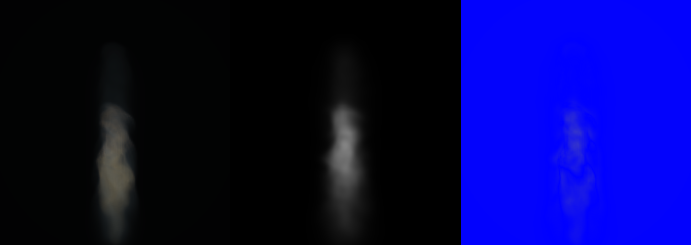

# Dual-Bank Volume Smoke R1

## Question and disposition

Can exactly 1,024 Gaussian records preserve broad smoke support while recovering boundary articulation if the source volume's positive extinction is explicitly divided between an independent coarse bank and a gradient-detail bank?

No for this first exact decomposition. The dual bank improves native luma MSE by only `0.68%`, reduces native active-pixel IoU, and regresses all three disjoint cameras. Direct inspection shows a smooth, blurred proxy with no recovered layered interior or sheet topology. The `512+512` arm does not earn a bank-fraction sweep or temporal witness.

This rejects positive normalized-gradient mass partition followed by independent Gaussian moment banks on this basin. It does not reject hierarchical occupancy, connected sheet primitives, or other volume-space representations that preserve topology explicitly.

## Roles and identity

- **Reference:** exact analytical R160 `operator_fire_0622` smoke teacher at simulator step 45, source radius `0.12`, flow `0.35`, route `native-3d-compute-fluid-raymarch-v0`, backend `WebGPU:apple`. Fluid SHA-256: `b9015d0d577ee99b48a3e5bebe207e5024a4e9ef63bd42a8192e65042c9540ee`.
- **Control:** reviewed gradient-plus-principal initializer, exactly 1,024 Gaussians. Product SHA-256: `167f72aa2b6eddec158e9ae6c25f6211b278380112a4e804fa1b0e2199523ff4`.
- **Treatment:** 512 coarse-support principal Gaussians plus 512 gradient-detail principal Gaussians. Product SHA-256: `89a07ba1b4bd6a18c8f7c31aa2458f8791070e529d79c8e7e34be9e651ecf4af`.
- **Mass rule:** `detail = density * 0.5 * normalizedSmokeGradient`; `coarse = density - detail`. Both banks use their own positive extinction for split medians, centroids, covariances, velocity witnesses, and serialized mass.
- **Camera split:** recorded native plus disjoint world-space side `+90 deg`, back `+180 deg`, and elevated `+35 deg`; overlap is zero.
- **Witness:** CPU full-covariance perspective Gaussian luma proxy, not the production compositor and not a beauty claim.

The treatment assigns 512 records to `3240.6605965` coarse extinction and 512 records to `163.2363514` detail extinction. Total extinction is conserved to `6.91e-13` relative error. Support leakage is `0/1024`, compared with `2/1024` for the control. All 511 coarse and 511 detail splits are genuinely oblique. CPU fit time is `22.33 s`.

## Quantitative result

Lower MSE and higher IoU are better. Percentages compare treatment MSE to the control.

| Camera | Control MSE | Dual-bank MSE | MSE change | Control IoU | Dual-bank IoU |
| --- | ---: | ---: | ---: | ---: | ---: |
| Native | 4.9181542e-4 | 4.8847808e-4 | -0.68% | 0.92236 | 0.89022 |
| Side +90 | 5.5146093e-7 | 6.4994845e-7 | +17.86% | 0.77803 | 0.73490 |
| Back +180 | 5.0260545e-7 | 6.1628679e-7 | +22.62% | 0.91450 | 0.88713 |
| Elevated +35 | 1.6820995e-6 | 1.7737084e-6 | +5.45% | 0.83667 | 0.84185 |

The tiny native MSE gain is not product-shaped signal. It comes with worse native support overlap, three-camera MSE regression, and no visible interior recovery.

## Image context

The native sheet below uses the role order **exact analytical teacher | 1,024-Gaussian dual-bank treatment | absolute luma difference**. It is one fixed simulator state, not a temporal sequence. The treatment preserves the gross body but smooths the interior into broad lobes; the reserved detail bank does not reproduce the reference's layered billowing or self-occluding sheets.



The hostile-camera sheets are much darker. They carry exact camera-bound metrics and reject gross view-dependent failure, but they are not visually authoritative for fine interior quality:

- [Side +90 analytical teacher, treatment, and difference](step-45/renders/side-plus-90/perspective-render-contact-sheet.png)
- [Back +180 analytical teacher, treatment, and difference](step-45/renders/back-plus-180/perspective-render-contact-sheet.png)
- [Elevated +35 analytical teacher, treatment, and difference](step-45/renders/elevated-plus-35/perspective-render-contact-sheet.png)

## Evidence hashes

- Fit report: `34c3241518b88e89963f358a03925b1a3fcd57513287e82ed43ad707fbb67ff8`.
- Gaussian product: `89a07ba1b4bd6a18c8f7c31aa2458f8791070e529d79c8e7e34be9e651ecf4af`.
- Camera split: `d20856a01a29c8c40ae0f4752cf595c3e60d04156229fc32a21eff2136d13851`.
- Native/side/back/elevated render reports: `1dea0f80fb8ed50d4478fa53bf3ce76ae276b6de7805de9e91bc1c2f07e6ee4d`, `a0c6e46876581385819fd0be5eb0cb1d8ed00cec118caa42fd9798cd8abccbf3`, `18f24eb8ff43a504064dbd6b75893c20af0d2cc39e482246f7e9dfb44696f042`, `4973f786f33cf1246147a96c7c01b796d101e369e893d7bb0ecb9fb6f9f557be`.

All values are bare SHA-256 hashes. Reports retain requested/effective route, backend, teacher, camera, product, count, and scale identities.

## Exact commands

```sh
node smoke-gaussian-oracle-fitter.mjs --manifest /private/tmp/kaminos-handy-smoke-temporal-ceiling-0715/artifacts/temporal-gaussian-ceiling-0715/accepted-source-r160-teacher-v9-barrier-receipt-m24/sim-step-45.manifest.json --out-dir artifacts/pyro-dual-bank-smoke-r1-0716/step-45 --budgets 1024 --density-threshold 0 --optimizer recursive-dual-bank-principal-moment-split --detail-budget-fraction 0.5 --detail-mass-fraction 0.5

node smoke-oracle-hostile-cameras.mjs --fit-report artifacts/pyro-dual-bank-smoke-r1-0716/step-45/oracle-fit-report.json --out-dir artifacts/pyro-dual-bank-smoke-r1-0716/step-45/cameras

node smoke-gaussian-oracle-renderer.mjs --fit-report artifacts/pyro-dual-bank-smoke-r1-0716/step-45/cameras/recorded-native/oracle-fit-report.json --raymarch-png /private/tmp/kaminos-handy-smoke-temporal-ceiling-0715/artifacts/temporal-gaussian-ceiling-0715/accepted-source-r160-teacher-v7-m24/maturity-probes/sim-step-45.png --out-dir artifacts/pyro-dual-bank-smoke-r1-0716/step-45/renders/recorded-native --budgets 1024 --extinction-scales 3.2,6.4,12.8 --coverage-scales 1,1.5,2 --projection native-camera
```

Each hostile render uses its camera-specific fit report and exact `dense-raymarch-smoke.png` under `hostile-gradient4/sim-step-45/CAMERA/teacher-640x455/`, with `--budgets 1024 --extinction-scales 0.1,0.2,0.4 --coverage-scales 1,1.5,2 --projection native-camera`.

## Next boundary

Do not sweep the coarse/detail record ratio or gradient multiplier. The detail bank received half the records and still collapsed its boundary mass into smooth Gaussian moments. The next useful representation must preserve connected source-volume structure explicitly, such as hierarchical occupancy or sheet/ridge primitives, rather than asking another moment partition to infer topology from local mass alone.
