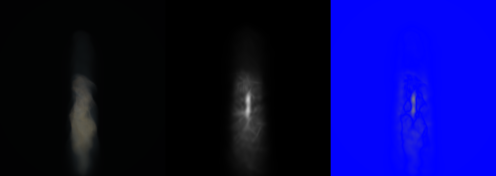
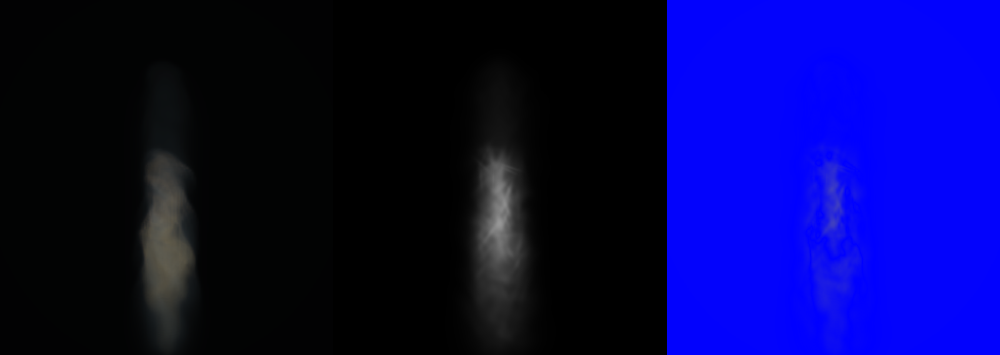

# Multi-View Smoke Geometry R1

## Question and disposition

Can bounded image-space refinement of exactly 1,024 Gaussian centers and covariances recover articulated tall-smoke structure that the accepted gradient-principal initializer misses?

No, not under this two-camera objective. The combined optimizer reduced its internal side/back objective by 22.9%, but failed the authoritative full-resolution witness on both training cameras and both untouched cameras. Center-only captured most of the internal gain and most of the visible collapse. Covariance-only was less destructive, but still lost to the untouched initializer on every camera and introduced a false bright spine. This route is rejected rather than tuned further.

This is a narrow negative result. It rejects direct low-resolution view-space center/covariance Adam refinement on this basin and renderer contract. It does not reject learned scene-fill smoke, hierarchical representations, volume-space objectives, or models with stronger spatial context.

## Roles and source identity

- **Reference:** exact analytical R160 `operator_fire_0622` smoke teacher at simulator step 45, source radius `0.12`, flow `0.35`, route `native-3d-compute-fluid-raymarch-v0`, backend `WebGPU:apple`. Fluid SHA-256: `b9015d0d577ee99b48a3e5bebe207e5024a4e9ef63bd42a8192e65042c9540ee`.
- **Control:** accepted gradient-plus-principal initializer, exactly 1,024 Gaussians. Product SHA-256: `167f72aa2b6eddec158e9ae6c25f6211b278380112a4e804fa1b0e2199523ff4`.
- **Treatment A:** centers and positive lower-Cholesky covariances optimized together. Product SHA-256: `707a049619cb4b08efaea3da2507fe96a565578dfb8f312735308335ea1eb19a`.
- **Treatment B:** covariances optimized while centers remain exact. Product SHA-256: `5ade81c82fa395c982a773e0b5567a563e6374274e723e1cc760380f03e79d42`.
- **Treatment C:** centers optimized while covariances remain exact. Product SHA-256: `0d9cbbc98556d6c49a6841a0395ecc537e1e817c0db0fa09bf78acc7c2b248a4`.
- **Training split:** side `+90 deg` and back `+180 deg`, downsampled from `640x455` to `160x114` by explicit factor `4`.
- **Heldout split:** recorded native camera and elevated `+35 deg`; neither participates in optimization.
- **Witness:** CPU full-covariance perspective Gaussian luma proxy. This is an isolated representation witness, not the production compositor or a beauty claim.

Every arm preserves per-record extinction and total represented extinction. Relative total-extinction error is `6.74e-10`. No hidden budget or iteration cap was applied. The combined, covariance-only, and center-only optimizer wall times were respectively `1.27 s`, `1.40 s`, and `1.13 s` on the local CPU.

## Quantitative result

Lower MSE and higher IoU are better. Side and back are training cameras; native and elevated are untouched holdouts. The control values are the accepted fixed-budget receipts from the preceding allocation experiment.

| Camera | Role | Control MSE | Combined MSE | Covariance-only MSE | Center-only MSE | Control IoU | Combined IoU | Covariance-only IoU | Center-only IoU |
| --- | --- | ---: | ---: | ---: | ---: | ---: | ---: | ---: | ---: |
| Native | heldout | 4.9181542e-4 | 7.5428936e-4 | 5.3226644e-4 | 6.0001731e-4 | 0.92236 | 0.76827 | 0.87791 | 0.80729 |
| Side +90 | train | 5.5146093e-7 | 6.5013738e-6 | 1.5571795e-6 | 5.3058590e-6 | 0.77803 | 0.29658 | 0.61131 | 0.30022 |
| Back +180 | train | 5.0260545e-7 | 1.5821754e-5 | 2.3419221e-6 | 8.5690546e-6 | 0.91450 | 0.27313 | 0.71858 | 0.32364 |
| Elevated +35 | heldout | 1.6820995e-6 | 1.1435332e-5 | 3.1673896e-6 | 8.3509986e-6 | 0.83667 | 0.52950 | 0.80498 | 0.64534 |

The internal objective moved in the opposite direction from the full-resolution witness:

| Treatment | Enabled heads | Initial objective | Final objective | Change | Support leakage |
| --- | --- | ---: | ---: | ---: | ---: |
| Combined | center + covariance | 0.00955399 | 0.00736980 | -22.9% | 14 / 1,024 |
| Covariance-only | covariance | 0.00955399 | 0.00901713 | -5.6% | 6 / 1,024 |
| Center-only | center | 0.00955399 | 0.00775094 | -18.9% | 6 / 1,024 |
| Control | none | n/a | n/a | n/a | 2 / 1,024 |

Support is recomputed after optimization from each Gaussian's world-space three-sigma major-radius envelope against the recorded `[-1, 1]^3` source bounds. It is not inherited from the initializer.

## Image context

Every sheet uses the same left-to-right roles: **exact analytical teacher | 1,024-Gaussian treatment proxy | absolute luma difference**. The native camera is the clearest inspection surface. The hostile-camera sheets are much darker and can reject gross geometric failure, but they cannot establish fine interior smoke quality.

The combined native treatment below concentrates energy into a bright axial core, hollows the broad body, and loses the teacher's layered interior. It is the visible failure corresponding to the worst combined-camera metrics.



The covariance-only native treatment preserves more of the control silhouette, but still creates a false luminous spine and does not recover billowing sheets. Its smaller visual regression agrees with the head ablation, but it remains worse than the control.



The center-only native treatment is retained as causal evidence for the collapse. It should be read with the same role order and is not a positive smoke candidate.

[Native analytical teacher, center-only treatment, and absolute luma difference](center-only-trained/renders/recorded-native/perspective-render-contact-sheet.png)

The exact training and elevated sheets are retained under each treatment's `renders/` directory. They are metric-bearing camera witnesses, not unlabeled temporal sequences.

## Optimizer contract

The optimizer uses exact projected-mean Jacobians for center gradients and exact projected-covariance gradients at the current center. Covariance-center coupling is explicitly omitted. Covariances use a positive-diagonal lower-Cholesky parameterization. Centers are bounded to `0.03` world units from their initializer; log-scale and off-diagonal Cholesky residuals are bounded to `0.25` and `0.01`. Per-record extinction is fixed. The objective combines value and image-gradient terms at scales `1,2,4,8` with weights `1` and `2`.

Explicit head switches are contract-tested: a disabled center head leaves positions exact, and a disabled covariance head leaves covariances exact. The wrapper rejects stale camera identity, wrong fluid/product identity, blank or partial teachers, hidden budget substitution, and radiance hash mismatch; failures write a durable report naming the phase and last trustworthy evidence.

## Hashes

- Combined config/report/fit: `cbd23716c85fd5a9e5cff66e80b5aaeaa7e73f5dfe00ddf1e8a6e685ed942a9c`, `1cae355dc28388972bef75f00ef22ecec0d9949dabb27f45cdbb2c97be5acca2`, `e89f99312ddd1f8377e972727ebda27f9957e874173ccd381fd2a25842c45aba`.
- Covariance-only config/report/fit: `2a65400c94050600783d5a4dc81f9d887d1581feb34bcdc15c709f1ab88acb8c`, `e163ed1c87048f270313e5a42051f68fad62a812877be33ad9f056774f15588a`, `e888d0d3932df08be2bb17cc75616c4aaa438d9bc068ae02306d8ebff32baeb6`.
- Center-only config/report/fit: `b9ebf1bba000492dc9c742e212457e39ee4a4554d8b1de2f7025b09320671b69`, `e02b247e6dead51d120d7be8ca96832414680691ed27126a54a5a5557a43bb32`, `368c7ad55e33128261fe1fa15f53b4bec4f14e6c2374fbdbcfe3d15227c0e28a`.

Hashes above are bare SHA-256 values in config/report/fit order. Product identities are listed with their roles earlier.

## Exact commands

```sh
node smoke-gaussian-oracle-renderer.mjs --optimize-geometry --geometry-config artifacts/pyro-multiview-smoke-geometry-r1-0716/side-back-train-config.json --out-dir artifacts/pyro-multiview-smoke-geometry-r1-0716/side-back-trained

node smoke-gaussian-oracle-renderer.mjs --optimize-geometry --geometry-config artifacts/pyro-multiview-smoke-geometry-r1-0716/covariance-only-train-config.json --out-dir artifacts/pyro-multiview-smoke-geometry-r1-0716/covariance-only-trained

node smoke-gaussian-oracle-renderer.mjs --optimize-geometry --geometry-config artifacts/pyro-multiview-smoke-geometry-r1-0716/center-only-train-config.json --out-dir artifacts/pyro-multiview-smoke-geometry-r1-0716/center-only-trained
```

For each exact arm name `side-back-trained`, `covariance-only-trained`, and `center-only-trained`:

```sh
node smoke-oracle-hostile-cameras.mjs --fit-report artifacts/pyro-multiview-smoke-geometry-r1-0716/ARM/oracle-fit-report.json --out-dir artifacts/pyro-multiview-smoke-geometry-r1-0716/ARM/cameras
```

Native render command, replacing `ARM` with one exact arm name:

```sh
node smoke-gaussian-oracle-renderer.mjs --fit-report artifacts/pyro-multiview-smoke-geometry-r1-0716/ARM/cameras/recorded-native/oracle-fit-report.json --raymarch-png /private/tmp/kaminos-handy-smoke-temporal-ceiling-0715/artifacts/temporal-gaussian-ceiling-0715/accepted-source-r160-teacher-v7-m24/maturity-probes/sim-step-45.png --out-dir artifacts/pyro-multiview-smoke-geometry-r1-0716/ARM/renders/recorded-native --budgets 1024 --extinction-scales 3.2,6.4,12.8 --coverage-scales 1,1.5,2 --projection native-camera
```

Side, back, and elevated renders use the camera-specific fit report and exact `dense-raymarch-smoke.png` under `hostile-gradient4/sim-step-45/CAMERA/teacher-640x455/`, with `--extinction-scales 0.1,0.2,0.4 --coverage-scales 1,1.5,2 --projection native-camera`.

## Next research boundary

Do not spend another slice tuning the learning rates, residual bounds, or camera weights of this objective. The route cannot beat its initializer on the cameras it directly trains against. The adjacent target should change the representation or supervision: preserve broad support as an explicit coarse component and learn or extract articulated residual structure from volume-space neighborhoods, sheets, or hierarchical occupancy rather than transporting every Gaussian under a global image loss.
