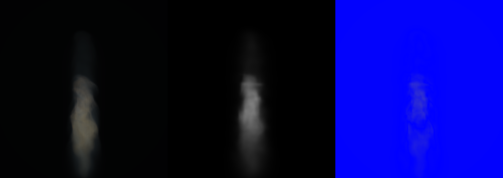
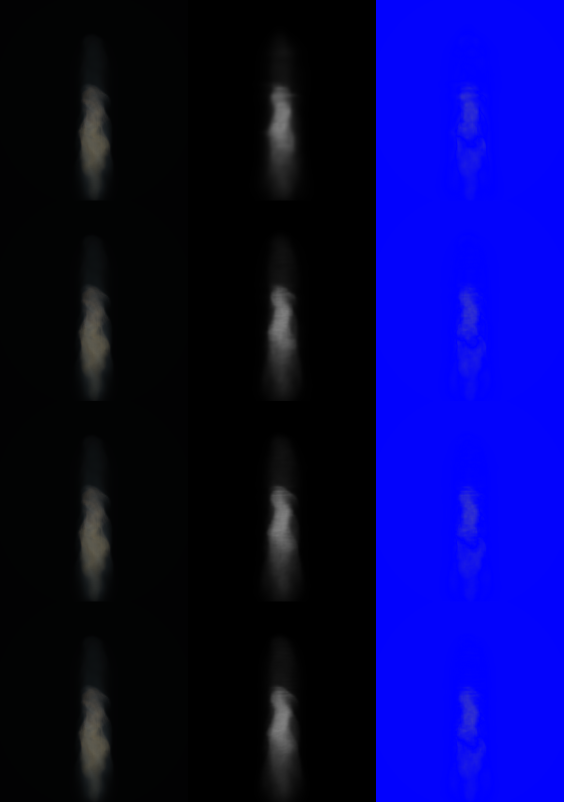

# Fixed-Budget Principal Smoke Allocation R1

## Question and disposition

Can a better spatial partition recover articulated smoke at exactly 1,024 Gaussians without changing the accepted R160 teacher, camera, renderer, or record budget?

The result is a bounded positive allocation finding, not a scene-fill pass. Oblique principal-axis partitions suppress the control's obvious axial bands. Combining the principal partition with the existing smoke-gradient allocation beats `gradient4-1024` luma MSE on the native camera and all three disjoint heldout cameras. It does not visibly reconstruct the teacher's internal billowing or self-occluding sheets, and two combined-arm Gaussians cross the analytical support bound. Neither treatment earns the 5-10 second motion witness.

## Roles and source identity

- **Reference:** exact analytical R160 `operator_fire_0622` smoke teacher, simulator step 45, source radius `0.12`, flow `0.35`, native 3D compute fluid raymarch on `WebGPU:apple`. Fluid SHA-256: `b9015d0d577ee99b48a3e5bebe207e5024a4e9ef63bd42a8192e65042c9540ee`.
- **Control:** accepted `recursive-gradient-moment-split`, exactly 1,024 Gaussians. Product SHA-256: `bf7f884bfa8807637940182eb1f4aa5b3443bece905f66534828ba6dc0e2c0ef`; committed fit report file SHA-256: `963484537ef5bc69572cfe81001b4accbac39914711b8cb261dd80d321398ef4`.
- **Treatment A:** density-weighted principal-axis moment splitting, exactly 1,024 Gaussians. Product SHA-256: `7771e48cbd5086f8d1796a235ed7feab0d23a4b41419a62ee4e8496400e432c4`; internal pre-self-reference `reportIdentity`: `4fa6727e75ecfe74d6947dafba45b3d91d9e30ea983eacc99a64e0bf500033a3`; committed report file SHA-256: `75690c0bf9af214cef3810a49f3980bc611e279aa9d0eaf7735d10edde9a7097`.
- **Treatment B:** smoke-gradient-weighted principal-axis moment splitting with fixed gain `4`, exactly 1,024 Gaussians. Product SHA-256: `167f72aa2b6eddec158e9ae6c25f6211b278380112a4e804fa1b0e2199523ff4`; internal pre-self-reference `reportIdentity`: `4d3f30e6bbe1d18903d2e89ecb7914a91d4eae879be0a9f55f8787de2d5727a8`; committed report file SHA-256: `ef5a8b844c001c2e986f45009b512bd56abadb4f682e439e01e47f946dceeca1`.
- **Render witness:** CPU full-covariance perspective Gaussian luma proxy. This is an isolated analytical witness, not the production compositor and not a beauty claim.
- **Camera split:** native calibration camera plus disjoint world-space side `+90 deg`, back `+180 deg`, and elevated `+35 deg` heldouts; camera overlap is zero.

## Quantitative result

Lower MSE and higher IoU are better. All rows use exactly 1,024 active records. Percentages compare Treatment B to the control.

| Camera | Control MSE | Principal MSE | Gradient + principal MSE | B vs control | Control IoU | Principal IoU | Gradient + principal IoU |
| --- | ---: | ---: | ---: | ---: | ---: | ---: | ---: |
| Native | 4.9635717e-4 | 4.8435792e-4 | 4.9181542e-4 | -0.91% | 0.91571 | 0.91878 | 0.92236 |
| Side +90 | 5.7330218e-7 | 5.2627842e-7 | 5.5146093e-7 | -3.81% | 0.77394 | 0.76566 | 0.77803 |
| Back +180 | 5.2127471e-7 | 5.0466276e-7 | 5.0260545e-7 | -3.58% | 0.91800 | 0.90409 | 0.91450 |
| Elevated +35 | 1.7071517e-6 | 1.7251498e-6 | 1.6820995e-6 | -1.47% | 0.83461 | 0.83668 | 0.83667 |

Both treatments preserve total extinction to less than `7e-13` relative error. Principal-only has zero support-leaking Gaussians. Gradient-plus-principal has 2 / 1,024 support-leaking Gaussians (`0.195%`). Every one of the 1,023 treatment splits is genuinely oblique. The corrected splitter selects only distinct projection buckets; the minimum selected gaps are `9.3735e-8` for Treatment A and `8.9094e-9` for Treatment B, with zero tied candidate boundaries encountered in this R160 fit. CPU fit time was `13.753 s` for principal-only and `17.357 s` for gradient-plus-principal on the local machine.

The exact control receipts are vendored under `control-step-45/`; their embedded original source paths are retained as provenance. The native render report file SHA-256 is `84c752ae0c5b3a4c9d6e42e767354891a12ab5a010bb9c6012b3ae904543621e`, the hostile camera-split report file SHA-256 is `81637e88b1fb33cdce0ab2f78e0fe0b3e349d3a565144a2009d656eedec946ba`, and the side/back/elevated render report file hashes are respectively `3c7bb12da310508f7345bbd227a1e8f13b3d49eed33b7c238046e431d7525569`, `5416a69e74f52b5e19b40fa99772e8842f28b090af93d577cd2c98a519dcf512`, and `312a92a36f6f2c83c92b13bb5d5f611ea20bba9768975d8a3a2bea9b3174cdab`.

## Image context

Each contact sheet below has the same left-to-right role order: **exact analytical teacher | 1,024-Gaussian treatment proxy | absolute luma difference**. The image is evidence for representation error only; color/beauty differences are not adjudicated because the witness is a single-channel proxy.

The native Treatment B sheet shows a smoother, more continuous body than the axial control, but the middle proxy remains visibly low-frequency and does not reproduce the reference's layered interior billowing.



For comparison, this is the accepted native `gradient4-1024` control under the same teacher and camera. The first row is the 1,024-record row; later rows are higher budgets and are not part of this fixed-budget adjudication.



The hostile-camera sheets are photometrically calibrated at extinction scales `0.1, 0.2, 0.4`; the selected scale is `0.2`. They are intentionally very dark and are not visually authoritative for fine interior articulation. Their metrics can reject gross view-dependent failure, but they cannot close visible smoke quality.

- [Side +90 Treatment B contact sheet](gradient-principal-step-45/hostile-renders-corrected/side-plus-90/perspective-render-contact-sheet.png)
- [Back +180 Treatment B contact sheet](gradient-principal-step-45/hostile-renders-corrected/back-plus-180/perspective-render-contact-sheet.png)
- [Elevated +35 Treatment B contact sheet](gradient-principal-step-45/hostile-renders-corrected/elevated-plus-35/perspective-render-contact-sheet.png)

## Rejected evidence

`step-45/hostile-renders/` is rejected and excluded. That first principal-only hostile run accidentally reused the native extinction bracket `3.2, 6.4, 12.8` instead of the teacher-matched hostile bracket `0.1, 0.2, 0.4`. Only `hostile-renders-corrected/` is cited above or used in the table.

## Exact commands

```sh
node smoke-gaussian-oracle-fitter.mjs --manifest /private/tmp/kaminos-handy-smoke-temporal-ceiling-0715/artifacts/temporal-gaussian-ceiling-0715/accepted-source-r160-teacher-v9-barrier-receipt-m24/sim-step-45.manifest.json --out-dir artifacts/pyro-principal-smoke-allocation-r1-0716/step-45 --budgets 1024 --density-threshold 0 --optimizer recursive-principal-moment-split

node smoke-gaussian-oracle-fitter.mjs --manifest /private/tmp/kaminos-handy-smoke-temporal-ceiling-0715/artifacts/temporal-gaussian-ceiling-0715/accepted-source-r160-teacher-v9-barrier-receipt-m24/sim-step-45.manifest.json --out-dir artifacts/pyro-principal-smoke-allocation-r1-0716/gradient-principal-step-45 --budgets 1024 --density-threshold 0 --optimizer recursive-gradient-principal-moment-split --structure-gradient-gain 4

node smoke-gaussian-oracle-renderer.mjs --fit-report artifacts/pyro-principal-smoke-allocation-r1-0716/gradient-principal-step-45/oracle-fit-report.json --raymarch-png /private/tmp/kaminos-handy-smoke-temporal-ceiling-0715/artifacts/temporal-gaussian-ceiling-0715/accepted-source-r160-teacher-v7-m24/maturity-probes/sim-step-45.png --out-dir artifacts/pyro-principal-smoke-allocation-r1-0716/gradient-principal-step-45/native-render --budgets 1024 --extinction-scales 3.2,6.4,12.8 --coverage-scales 1,1.5,2 --projection native-camera

node smoke-oracle-hostile-cameras.mjs --fit-report artifacts/pyro-principal-smoke-allocation-r1-0716/gradient-principal-step-45/oracle-fit-report.json --out-dir artifacts/pyro-principal-smoke-allocation-r1-0716/gradient-principal-step-45/hostile-cameras
```

Each corrected hostile render used its camera-specific fit report and exact teacher PNG with `--budgets 1024 --extinction-scales 0.1,0.2,0.4 --coverage-scales 1,1.5,2 --projection native-camera`.

## Claim boundary and next experiment

Spatial orientation matters: the old axis-aligned partition was leaving measurable error and visible lattice at the same record count. Spatial allocation alone is not the missing scene-fill mechanism. The next competent test must let centers and covariances move under a multi-view image-space objective while preserving extinction/support and retaining the analytical teacher as reference. Another hand-selected split heuristic or Gaussian-count sweep is not justified by this result.
