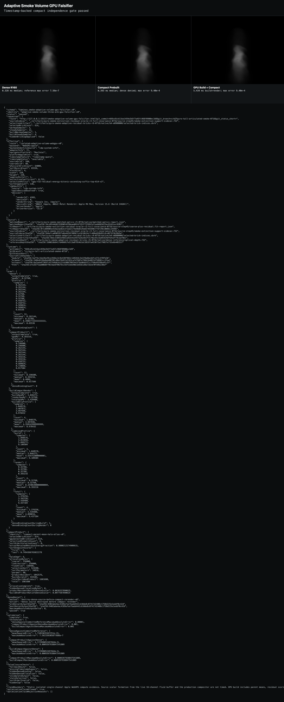

# Adaptive Smoke Volume GPU Falsifier R7

## Disposition

R7 establishes a **truthful, independently resident compact smoke product and a correct on-device builder, but no frame-time win in this isolated implementation**.

- The prebuilt and GPU-built compact arms both reproduce the persisted R6 top-614 selection: zero membership mismatch, zero sort-order violations, and `98.0021%` retained residual energy.
- Both compact arms have maximum optical-depth error `9.39794e-4` versus dense, inside the immutable `1e-3` limit. Dense matches the committed reference within `7.56234e-7`, inside `1e-5`.
- Compact rendering remains bit-identical after the dense GPU source buffer is destroyed. No dense binding or hidden dense allocation is present during compact rerender.
- Product residency is 1,042,576 bytes, or `6.3634%` of one dense scalar field. Product plus build scratch is 1,601,680 bytes, or `9.7759%`.
- The final compact render median is `0.393216 ms`, slower than dense at `0.327680 ms`. GPU build plus compact render is `5.439488 ms` median. This route therefore does not justify per-frame replacement or low-cadence amortization as currently implemented.

`valid-optimization-evidence` means the evidence packet passed route, backend, timestamp, numerical, allocation, selection, and independence gates. It does **not** mean the measured optimization is economically positive.

## Visual Context

The image below is **not a temporal sequence**. All panels render the same static source state through the same native camera, bounds, optics, and `320x228` output:

1. **Dense R160**: control and committed-reference traversal.
2. **Compact Prebuilt**: persisted R6 R40 parent field plus 614 selected R160 residual bricks, rerendered after dense-source destruction.
3. **GPU Build + Compact**: treatment built on device from the dense scalar state using parent means, residual scoring, sentinel-padded bitonic sort, top-K selection, indirection, and halo-atlas packing; compact rendering has no dense binding.

All three retain the same visible tongue/body structure at this scale. The compact roles carry the bounded depth error above; visible similarity alone is not the acceptance authority.



Inspected at original resolution after Greenroom job `431665604d14`. Screenshot SHA-256: `85228dba7cc93897b3162ac5bc0e32ebe87afca11a72bc84accc8f23c8b7bfb8`.

## Final Route

| Gate | Result |
| --- | --- |
| Greenroom job | `431665604d14`, exit `0`, no queue warnings |
| Witness timestamp | `2026-07-17T01:52:46.081Z` |
| Kaminos commit | `669cd5cb11ba1459e2b5f7a45fc968f0900ec3d9`, clean worktree receipt |
| Effective route | `isolated-adaptive-volume-webgpu-v0` |
| GPU identity | `WebGPU:apple`, authority `cdp-system-info` |
| Effective device | `ANGLE Metal Renderer: Apple M4 Max, Version 15.6 (Build 24G84)` |
| Browser | one persistent Google Chrome; `1600x1100` window; CDP port `49413` |
| Timestamp authority | required `timestamp-query`, available |
| Source/hierarchy | R160 scalar source; R40 hierarchy; 64,000 physical bricks |
| Sort | 65,536 records, 1,536 explicit `score=-1` sentinels, 136 complete stages |
| Selection | 614 requested/built; zero mismatch; zero order violations; no hidden cap |
| Dense denial | pre/post SHA `9402abe4ac4189afeefbadd442cb10de8c07417d2408c1758d225e1eddf0c42d`; maximum delta `0` |
| False-closure checks | all false |
| Claim rejection reasons | none |

## Timing And Storage

| Arm | GPU median | Sample range | Result |
| --- | ---: | ---: | --- |
| Dense R160 render | `0.327680 ms` | `0.262144..0.655360 ms` | reference control |
| Compact prebuilt render | `0.393216 ms` | `0.196608..0.917504 ms` | truthful but no median speedup |
| GPU build only | `3.997696 ms` | `1.048576..8.978432 ms` | expensive and variable |
| GPU build within combined arm | `5.046272 ms` | `1.048576..9.109504 ms` | expensive and variable |
| GPU-built compact render | `0.327680 ms` | `0.327680..0.393216 ms` | truthful compact traversal |
| GPU build plus render | `5.439488 ms` | `1.376256..9.437184 ms` | no per-frame economic win |

Storage is more encouraging than time:

- coarse R40: `256,000` bytes
- indirection: `256,000` bytes
- padded fine atlas: `530,496` bytes
- resident product including params: `1,042,576` bytes (`6.3634%` of dense scalar)
- sort and parameter scratch: `559,104` bytes
- build product plus scratch: `1,601,680` bytes (`9.7759%` of dense scalar)

No double buffer is used in this isolated static harness. A production temporal implementation would need to charge any double buffering, scalar formation, synchronization, and generation churn separately.

## Source And Output Hashes

- Matched-optics report: `34cd9544b823289054558eae09247353772599fe21add665623ac8163cec9382`
- Extinction/support sidecar: `564efca0905957a8a44592309b7ce1618b14cfc486e658d92c6cd0f323b26b5a`
- Persisted R6 selection: `4bbc3105534b61a92e41e45fa2b2d52f3178a191cba95424dfb41df74ceaf8ec`
- Dense reference depth: `16002db6417d46601fe513a87954b1dc58197a4536f2a17902fe732e6b40551f`
- Final browser report: `34b7012ed7f1d9fab4d964a43951e1a213f8aed796a7e7d1d4f7b0c65319064e`
- Final witness report: `b23fdbe23f800114851a64a98c37df3319fce0acc9f569c72e37340c5f2f4de6`
- Final screenshot: `85228dba7cc93897b3162ac5bc0e32ebe87afca11a72bc84accc8f23c8b7bfb8`

## Commands

```sh
node tests/smoke-adaptive-volume-gpu-falsifier-contracts.mjs
node tests/smoke-adaptive-residual-brick-frontier-contracts.mjs
node --check smoke-adaptive-volume-gpu-falsifier.mjs
node --check smoke-adaptive-volume-gpu-falsifier-browser.js
node --check smoke-adaptive-volume-gpu-witness.mjs
git diff --check
```

```sh
cd /Users/noahlyons/dev/gpu-greenroom
uv run gpu-greenroom submit \
  kaminos_adaptive_smoke_volume_gpu_falsifier \
  /private/tmp/kaminos-pyro-tall-articulated-smoke-0716-r2/artifacts/pyro-smoke-adaptive-residual-bricks-r6-0716/native/b4-e0980000/selected-brick-indices.sbrk \
  /Users/noahlyons/.local/state/gpu-greenroom/outputs/kaminos-pyro-adaptive-smoke-volume-gpu-r7-0716-run9
```

The expanded command, cwd, environment, null timeout, input, output, timestamps, and exit status are in `final/greenroom-receipt.json`.

## Diagnostic Chain

Every earlier run is preserved under `diagnostics/`; no prior image or report was overwritten.

| Run | Job | Finding |
| --- | --- | --- |
| 1 | `be31058cc471` | bind-group failure plus terminal-state polling defect |
| 2 | `4630bc8d1ffc` | stale orphan server correctly rejected |
| 3 | `ee8f121328f6` | empty marker-pass timestamp remained zero |
| 4 | `968e8d235fd8` | incomplete sort generation and wrong selection exposed |
| 5 | `6fb64093f32a` | non-power-of-two 64,000-record sort rejected |
| 6 | `09e3dee50a24` | padded sort established ascending orientation |
| 7 | `a70112651c8a` | review later identified partial 64,000-thread sort dispatch |
| 8 | `75d7f3a39fc7` | all substantive gates passed; provisional fallback state poisoned host redisposition |
| 9 | `431665604d14` | all authority, correctness, independence, and evidence gates passed |

## Claim Boundary

R7 closes the hidden-oracle question for this static scalar product: the compact renderer does not require retained dense state, and the on-device builder can reproduce the persisted 98%-energy selection and rendered output. It also falsifies the current economic thesis: sparse traversal is not faster than dense in the final matched median, while construction is an order of magnitude more expensive than dense traversal.

This does not time scalar extinction formation from the live 16-channel fluid buffer, the production compositor, full-scene ray coverage, temporal selection churn, or double buffering. It is one native camera and one static state. The next admissible move is not temporal learning or integration; it is either a substantially cheaper selection/build algorithm plus a traversal that wins on broader scene geometry, or disposition of this representation as a memory-quality trade rather than a simulator/render-cost win.
