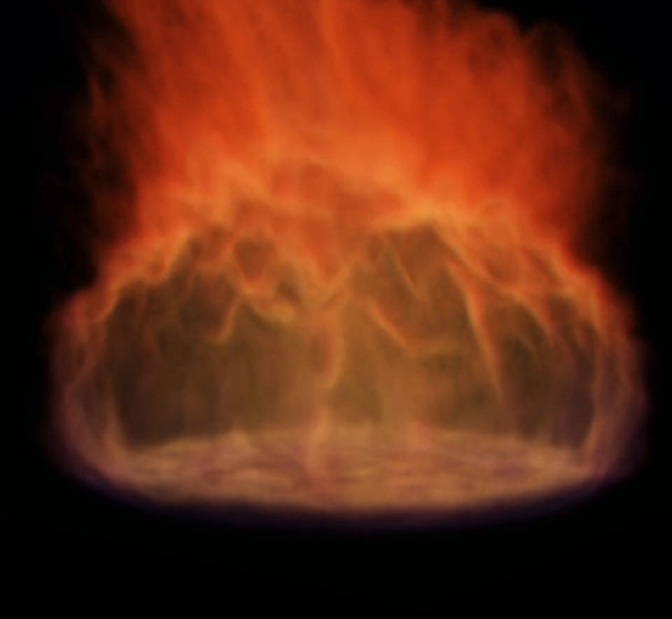
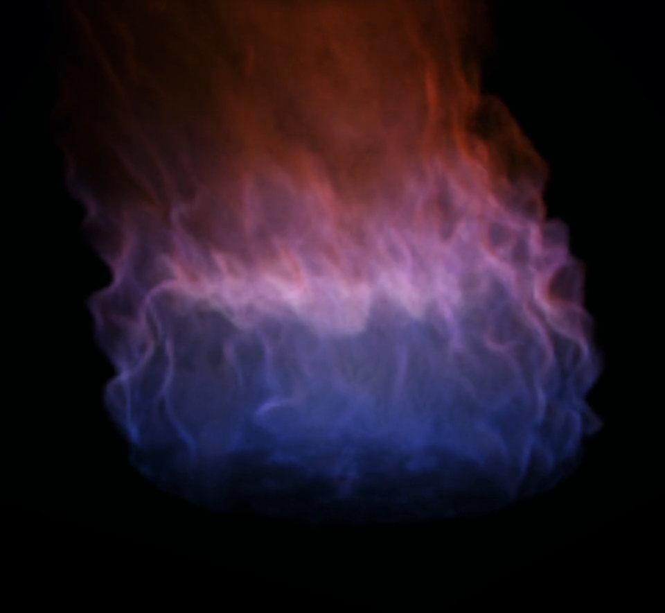
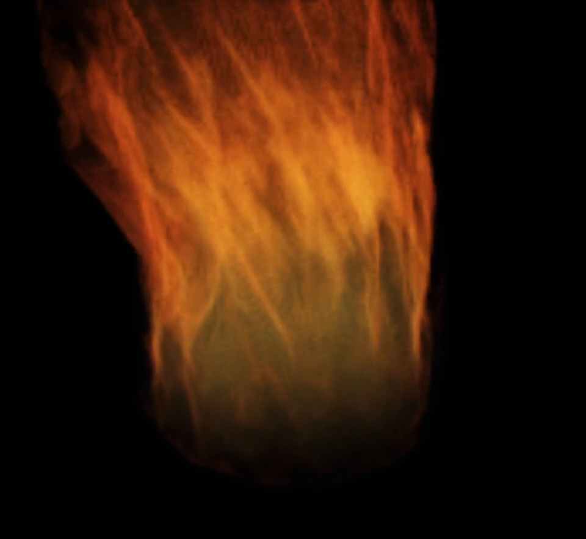
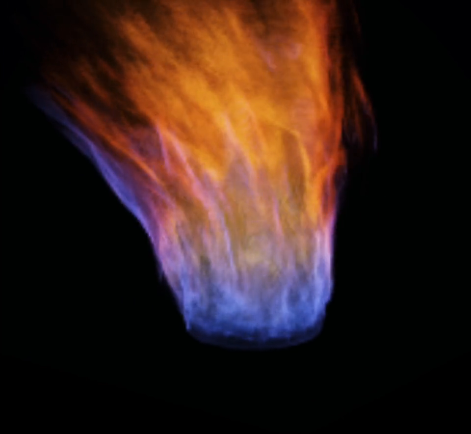

# Live Combustion

These compositions and studies were captured directly from the live browser
runtime while one stateful WebGPU combustion material was being authored. The
material keeps its momentum and history as source geometry, energy, structure,
and color change.

## Complete Composition

**Ignition, compression, rebirth.** A violet-rooted ignition grows into a warm
column, develops width and lean, constricts toward a needle, then reblooms as a
low burner before withdrawing into darkness. [Watch the complete
composition.](assets/composition-ooh-baby.mp4)

## Authored Transitions

| Phase transition | Warm morphology | Ignition sting |
| --- | --- | --- |
|  |  |  |
| Cool expansion and contraction with a continuous violet interface. [Motion](assets/composition-phase-transition.mp4) | A broad burner collapses toward a jet and rebuilds without resetting. [Motion](assets/composition-warm-morphology.mp4) | A blue base catches, rises, constricts, and leaves the frame. [Motion](assets/composition-ignition-sting.mp4) |

## Material Studies

| Chromatic column | Warm width cycle | Blue-violet width cycle |
| --- | --- | --- |
|  |  |  |
| Orange crown, luminous interface, cool rooted body. [Motion](assets/chromatic-combustion-column.mp4) | A live contraction and expansion through a warm basin. [Motion](assets/warm-width-cycle.mp4) | Connected cool-spectrum control with a changing footprint. [Motion](assets/blue-violet-width-cycle.mp4) |

| Violet filament drive | Live contraction | Cool oscillation |
| --- | --- | --- |
|  |  |  |
| Thin lateral sheets and filament-rich breakup. [Motion](assets/violet-filament-drive.mp4) | A state-history contraction from the original basin tour. [Motion](assets/live-contraction.mp4) | An alternate blue-violet treatment with broad oscillation. [Motion](assets/cool-oscillation.mp4) |

The browser-native screening room lives in [`index.html`](index.html). Serve
the repository with `python3 serve.py 8095`, then open
`http://127.0.0.1:8095/docs/flame-atlas/`.

## Evidence Boundary

The films preserve source timing without optical flow, frame synthesis,
retiming, interpolation, or cadence repair. The public presentation makes no
simulator frame-rate, universal device-performance, or final quality-tier
claim. Exact derivative identities live in
[`capture-manifest.json`](capture-manifest.json); source identities and
inspection receipts remain in the campaign accountability surface.
