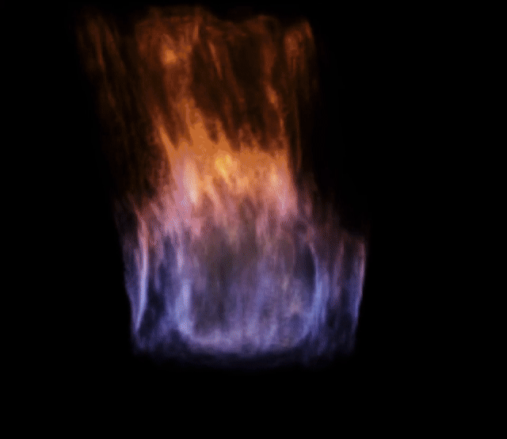
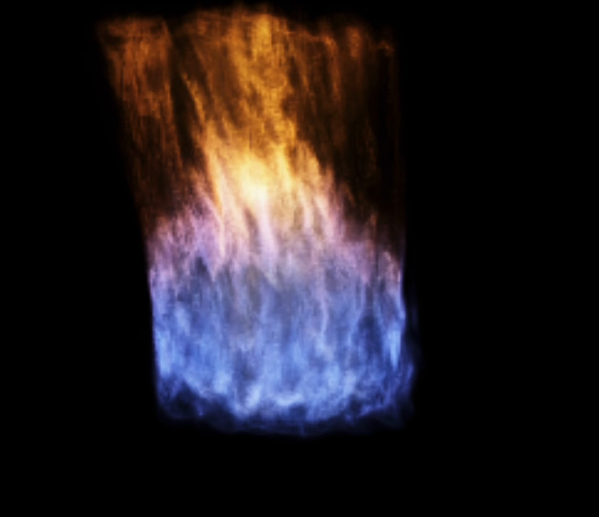
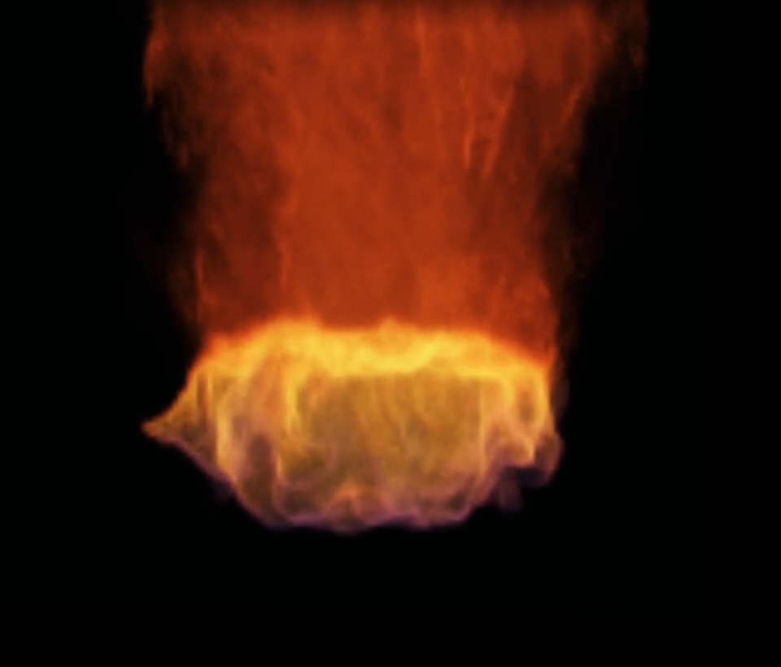
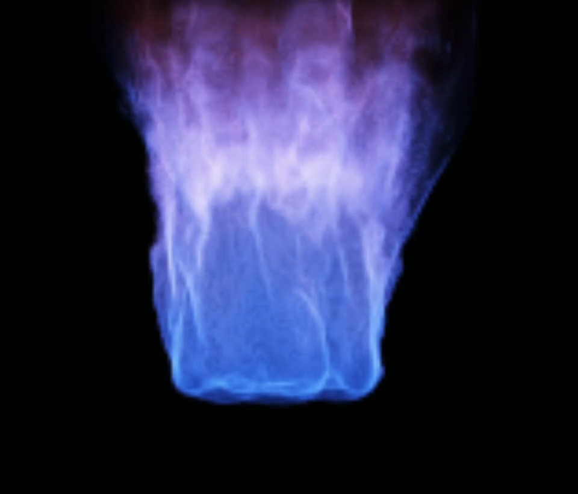
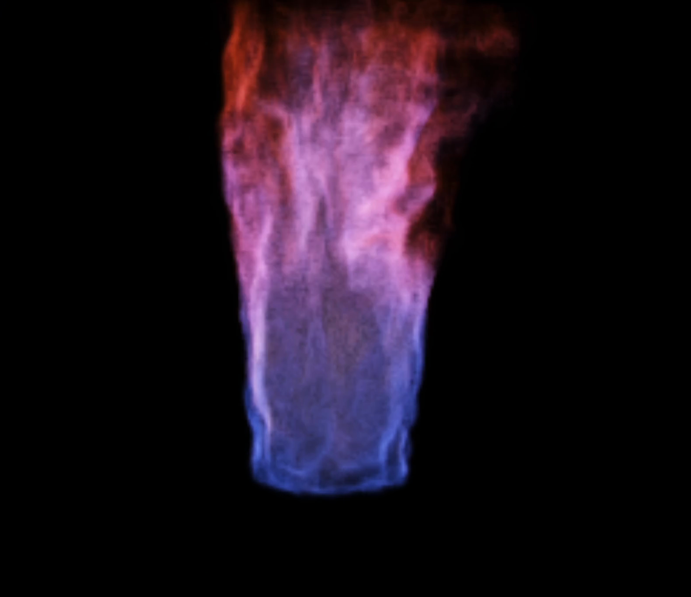
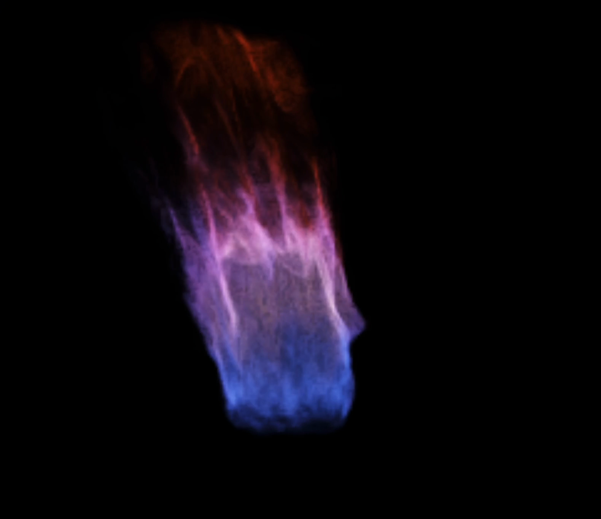
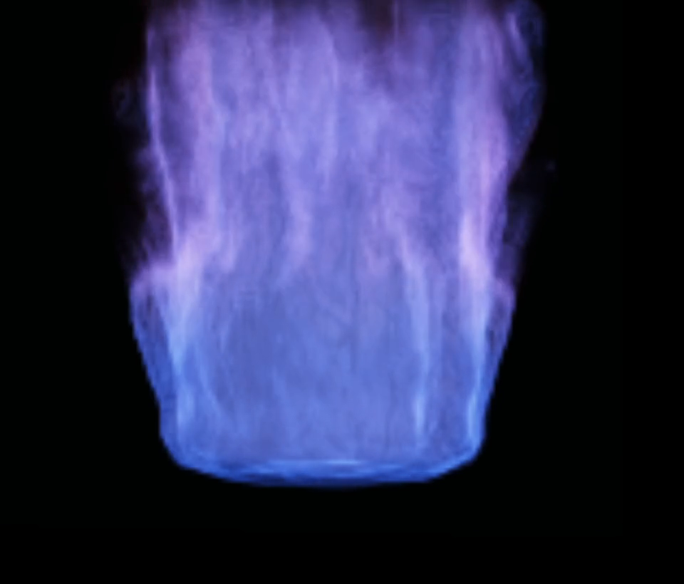

# Live Combustion Atlas

These captures follow one browser-native `96^3` WebGPU combustion material as
it moves through authored color, width, structure, and state-history basins.
They preserve the recorded source timing; no optical flow, frame synthesis,
retiming, or cadence repair was applied.

## Primary Forms

| Chromatic column | Warm width cycle | Blue-violet width cycle |
| --- | --- | --- |
|  |  |  |
| Orange crown, luminous interface, cool rooted body. [Motion clip](assets/chromatic-combustion-column.mp4) | A live contraction and expansion through a warm basin. [Motion clip](assets/warm-width-cycle.mp4) | Connected cool-spectrum control with a changing footprint. [Motion clip](assets/blue-violet-width-cycle.mp4) |

## Structural Range

| Violet filament drive | Live contraction | Cool oscillation |
| --- | --- | --- |
|  |  |  |
| Thin lateral sheets and filament-rich breakup. [Motion clip](assets/violet-filament-drive.mp4) | A state-history contraction from the original basin tour. [Motion clip](assets/live-contraction.mp4) | An alternate blue-violet treatment with broad oscillation. [Motion clip](assets/cool-oscillation.mp4) |

The browser-native presentation lives in [`index.html`](index.html). Serve the
repository with `python3 serve.py 8095`, then open
`http://127.0.0.1:8095/docs/flame-atlas/`.

## Evidence Boundary

The six MP4s are H.264, BT.709, source-timed derivatives with a nominal `60/1`
video stream rate. Their cadence identifies the media stream, not a universal
simulator-performance claim. The animated README lead is a nine-second,
12-fps presentation derivative of the chromatic-column capture. Exact public
derivative identities live in [`capture-manifest.json`](capture-manifest.json).

Capture identity, source hashes, cut windows, and inspection receipts are
preserved in the campaign accountability surface rather than duplicated into
the public repository.
