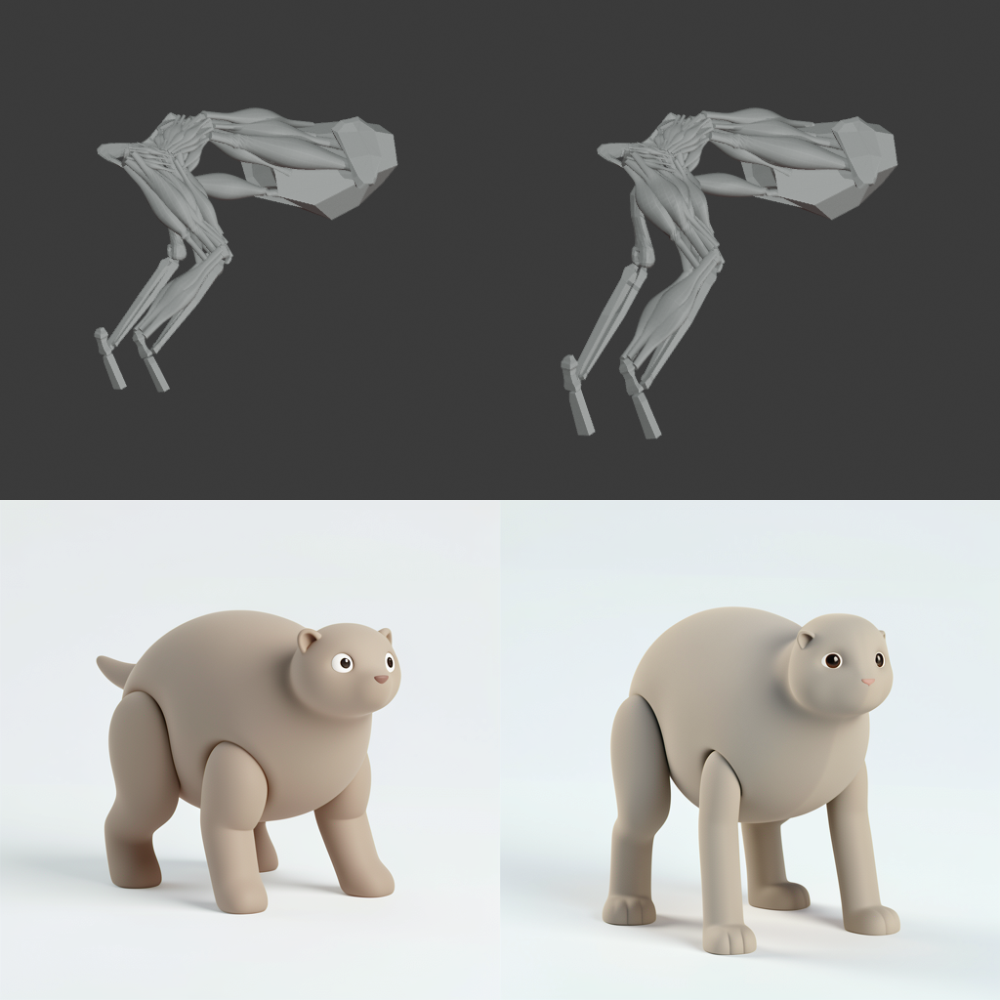
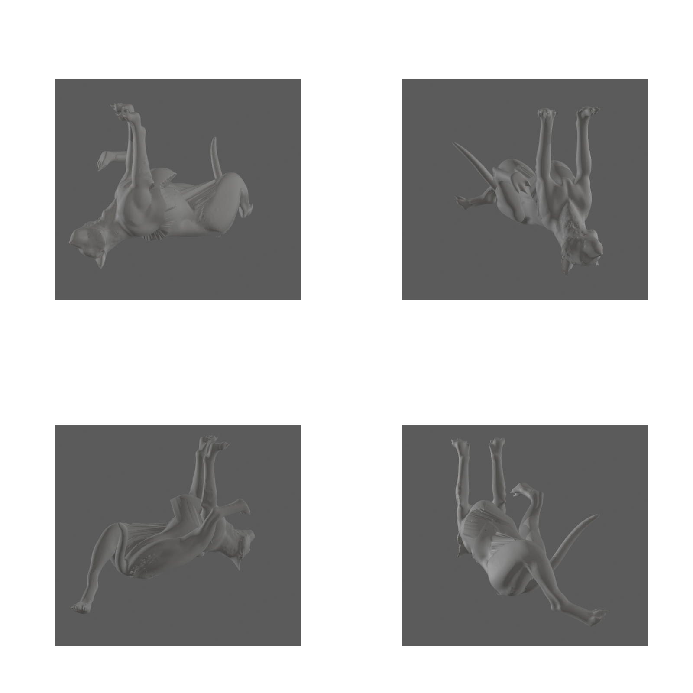
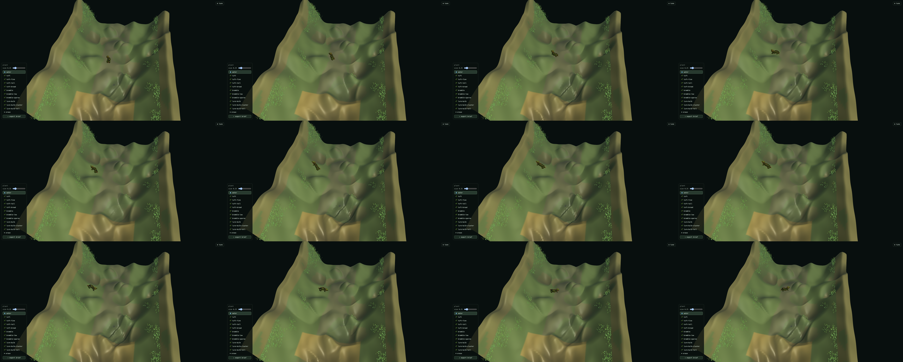

# Generated Beings

> Generated creatures can preserve deliberate morphology through generative transformation and return to mechanical control.

Kaminos has exercised four adjacent parts of that proposition: a bounded
morphology edit survived image generation, a repeated image-to-3D loop returned
casts that could be registered closely, one reconstructed cast was consumed by
an ordinary control rig after manual skinning, and a separate textured creature
was driven across live terrain. **These are separate assays**, not one specimen
moving through one uninterrupted production pipeline.

## Morphology Survives

The top row shows one authored carrier before and after a bounded
posterior-field edit. The bottom row shows their generated descendants. Prompt,
camera, generation route, and seed `80303` were held fixed. The edited carrier
produced a corresponding change in support stance and whole-body mass
distribution after learned image elaboration.

This supports one steerable low-frequency morphology channel in this exact
assay family. It does not establish monotonic parameter response, arbitrary
source or seed invariance, anatomical correspondence, or a general creature
compiler.

## Structure Returns

A separate polygonal-cat route was taken through image elaboration and spatial
reconstruction twice. The second image retained the same low-poly feline basin
while changing the head, muzzle, back, and surface organization. After one
global similarity fit, the two reconstructed casts registered with the
following normalized nearest-vertex residuals:

| Direction | Median | P90 | P95 |
| --- | ---: | ---: | ---: |
| cycle two to cycle one | 0.00443 | 0.01559 | 0.02103 |
| cycle one to cycle two | 0.00650 | 0.01731 | 0.02246 |

The fitted uniform scale was `1.032`. These measurements establish tight
assay-local global registration. They are not anatomical correspondence,
common topology, nearest-surface distance, or arbitrary-cast reliability.

## Mechanical Control

This returned 50,501-vertex cast was registered to a control armature and then
posed through ordinary armature controls. Skinning weights were painted
manually before the articulated deformation shown here. The recovered scene
preserves a large asymmetric hind-limb pose while the mesh continues to read as
one coherent whole-body cast.

This result does not establish automatic skinning, production deformation
quality, or a general registration-and-articulation method. It demonstrates
that one generated and reconstructed body retained enough usable structure to
be mechanically consumed.

## World Consumption

A different textured reconstruction was exercised in a browser world. The
creature followed planned terrain routes, tracked heading and terrain height,
received section-local support offsets, settled at its destination, and then
selected another route. The twelve-frame sequence spans one completed journey,
the destination hold, and the beginning of a second journey.

The exact route used a 148,118-vertex textured cast and an analytical
axial-deformation field. It demonstrates one generated body consuming
terrain-relative motion in the browser; it does not establish generalized
autorigging, arbitrary-terrain locomotion, collision avoidance, or production
crowd behavior.

## Research Frontier

The current work can preserve deliberate low-frequency morphology through
generation and return some reconstructed bodies to mechanical control. The
next problem is stronger: recover useful structure added by the generator as
named, editable authority, so generation expands the authoring language instead
of terminating it.

## Retained Artifacts

| Public artifact | SHA-256 |
| --- | --- |
| `morphology-intervention-seed80303.png` | `41e541032835b94a3df5488d822f258ba9a6fc13e736283f2d47c1dfa0169a53` |
| `registered-cast-articulation.png` | `ddd85190dcf618ef73ddc1352a7949ff819338ed0c01391a7bb5827fde0d7227` |
| `terrain-following-motion.png` | `fb03f38836382c963d356eddc09aaf4ffcbb54b2d1a727f63be59041a0081ddc` |
